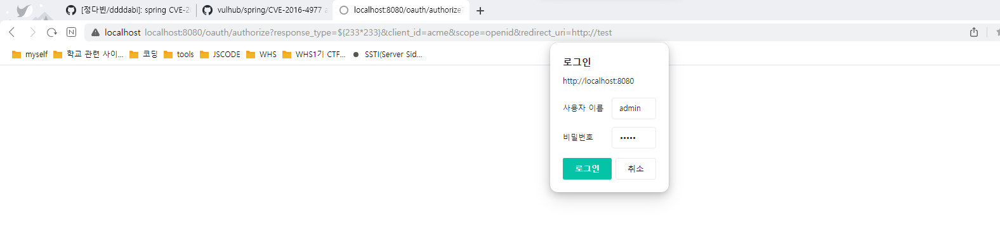
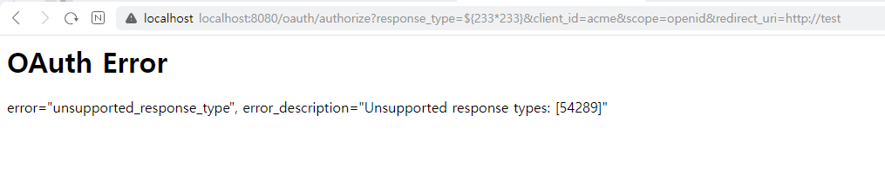
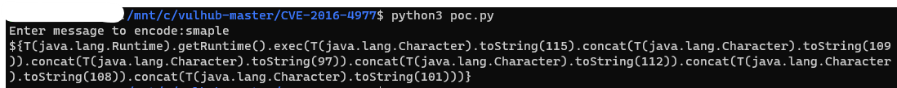
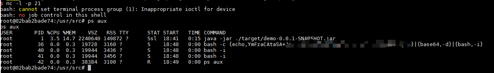

# Spring Security OAuth2 Remote Command Execution Vulnerability (CVE-2016-4977)


Spring Security OAuth는 표준 Spring 및 Spring Security 프로그래밍 모델과 구성 숙어를 사용하여 OAuth(1a) 및 OAuth2와 함께 Spring Security를 사용할 수 있도록 지원합니다.

원격 공격자는 오류 처리를 위해 화이트라벨 보기를 사용할 때 SpEL(Springs Expression Language)을 통해 악의적인 매개 변수를 구성하여 명령을 실행할 수 있습니다.

Reference links.

- http://secalert.net/#CVE-2016-4977
- https://deadpool.sh/2017/RCE-Springs/
- http://blog.knownsec.com/2016/10/spring-security-oauth-rce/

## 취약성 환경

다음 명령을 실행하여 도커 환경에서 Spring Security OAuth 응용 프로그램을 시작한다.

```
docker compose up -d
```

다음 localhost:8080으로 접속한다.

## Exploit

http://your-ip:8080/oauth/authorize?response_type=${233*233}&client_id=acme&scope=openid&redirect_uri=http://test
먼저 접속을 하면 로그인 창이 뜨는데 admin, admin으로 로그인을 한다.




이후 `${233*233}` 의 값을 확인할 수 있다.




poc.py를 통해 reverse shell을 진행한다.




이후 요청하면 reverse shell을 얻을 수 있다.


