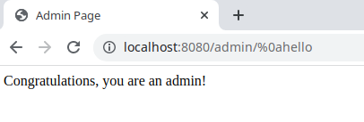

# CVE-2022-22978

**Contributors**

* [왕현빈_KimWang906](https://github.com/KimWang906)

## 요약

* Spring Security 5.5.6과 5.6.3, 지원되지 않는 오래된 버전에서 RegexRequestMatcher가 일부 servlet container에서 우회할 수 있게 잘못된 구성을 하기 쉽습니다.
* 정규식에 `.`과 RegexRequestMatcher가 함께 사용될 경우 인증 우회가 가능합니다.

참고자료:

- <https://tanzu.vmware.com/security/cve-2022-22978>
- <https://github.com/DeEpinGh0st/CVE-2022-22978>

## 취약한 환경 구성

서버가 시작되면, 브라우저에서 <http://your-ip:8080/admin>로 접속합니다.  
접속 시 admin 페이지에 접근할 수 없는 것을 확인할 수 있습니다.

## 취약점 발생 상황 구현

admin 페이지에 다음과 같이 요청을 보내면 아래 사진과 같이 인증에 성공한 모습을 확인할 수 있습니다.

- <http://your-ip:8080/admin/%0atest>
- <http://your-ip:8080/admin/%0dtest>

## 정리

Spring Security에서 오래된 버전(5.5.6, 5.6.3 etc)를 사용할 때,  
RegexRequestMatcher에 `.` 정규식이 함께 사용될 시 **linefeed(%0a)** 또는 **c return(%0d)** 문자열을 통해 인증 우회를 하여 권한 상승이 가능합니다.
이를 막기 위해 보안 패치 내용을 주기적으로 확인하여 소프트웨어를 업데이트하거나 취약점이 발생한 코드를 사용하는 것을 피하는 것이 좋습니다.