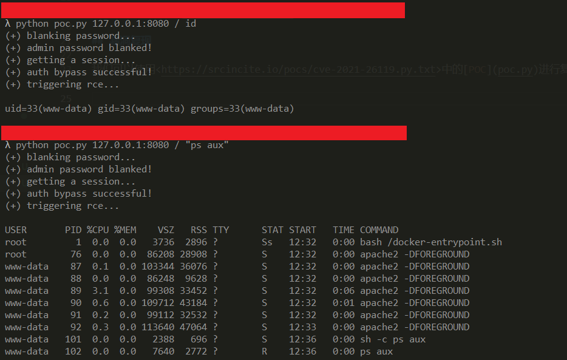

# Tiki Wiki CMS Groupware 21.1 Authentication Bypass (CVE-2020-15906)

**Contributors**

    [전해준(@haijun9)](https://github.com/haijun9)

### 요약

Tiki Wiki CMS 그룹웨어 또는 간단히 Tiki는 PHP로 주로 작성되고 GNU Lesser General Public License (LGPL) 라이선스 하에 배포되는 무료 오픈 소스 Wiki 기반 콘텐츠 관리 시스템 및 온라인 오피스 스위트입니다.

TikiWiki CMS 그룹웨어 16.x - 21.1 버전에 원격으로 인증되지 않은 공격자가 로그인 페이지를 우회할 수 있게 해주며, 이로 인해 Tiki Wiki CMS의 완전한 침투가 가능한 취약점이 발견됩니다. 공격자는 관리자 계정을 무차별 대입(브루트포스)하여 계정이 잠길 때까지 시도할 수 있습니다. 그 후 비어 있는 비밀번호를 사용하여 관리자로 인증하고 접근할 수 있습니다.

참고:
- https://info.tiki.org/article473-Security-Releases-of-all-Tiki-versions-since-16-3
- https://github.com/S1lkys/CVE-2020-15906
- http://packetstormsecurity.com/files/159663/Tiki-Wiki-CMS-Groupware-21.1-Authentication-Bypass.html
- https://srcincite.io/pocs/cve-2021-26119.py.txt

### 환경 구성 및 실행

`docker compose up -d` 커맨드를 입력하여 Tiki Wiki CMS 21.1을 실행

서버 실행 후 `http://your-ip:8080`에 환영 홈페이지를 접속

쉘에서 `python poc.py your-ip:8080 / id`을 입력하여 결과를 확인. 

### 결과

### 정리

[POC](https://srcincite.io/pocs/cve-2021-26119.py.txt) 원격 코드 실행으로 이어질 수 있는 두 가지 버그가 발견되었다.

Bug 1: CVE-2020-15906
 
    - 인증되지 않은 사용자가 관리자 계정을 50회 이상 무차별 대입 공격하여 빈 
    비밀번호로 로그인하는 방식으로 인증을 우회할 수 있다.
 
    - 버전이 21.1 이하(UY_Scuti)에서 영향을 미친다.

Bug 2: CVE-2021-26119
 
    - 관리자 권한의 사용자가 'template_object' 속성을 활용하여 Smarty 템플릿 엔진의 샌드박스를 탈출하여 서버 측 템플릿 인젝션을 유발할 수 있고 원격 코드 실행이 가능해진다.
 
    - 22.2 이하(Corona_Borealis)와 Smarty 버전 3.1.38(최신)에서 영향을 미친다.

*경고* - 이 공격을 실행하면 관리자 계정이 잠길 수 있다
