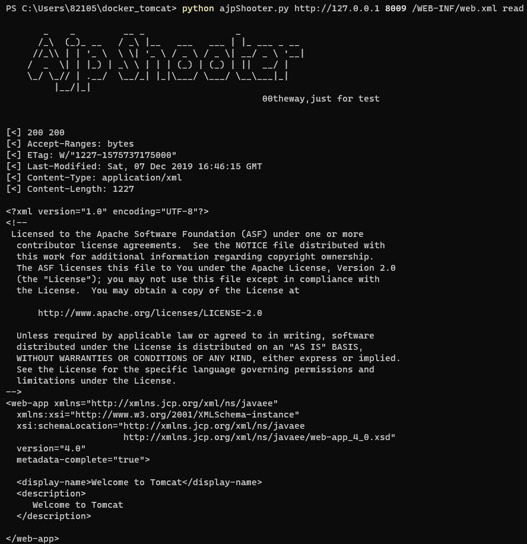

# CVE-2020-1938

**Contributors**

-   [박정은(@mythofsummer)](https://github.com/mythofsummer)

 

### 요약
-   Ghostcat이라고도 불리는 CVE-2020-1938은 Apache Tomcat-AJP 취약점.
-   AJP Request가 Apache에서 Tomcat으로 전송될 때 사용자 입력값 검증없이 실행되면서 임의로 파일 읽기나 실행이 가능.
-   Request 메시지 헤더에서는 파일 확장자에 따라 *.JSP파일은 JspServlet.java에서 처리하고 그 외의 파일은 DefaultServlet.java에서 처리되게 됨. 임의의 파일이 실행되기 위해서는 DefaultServlet.java을 실행해야 하는 파일도 JspServlet.java을 수행하게 하는 것이 취약점의 핵심.

 

References:

- [https://tanzu.vmware.com/security/cve-2022-22965](https://study-ce.tistory.com/69)>
- [https://www.lunasec.io/docs/blog/spring-rce-vulnerabilities/](https://www.igloo.co.kr/security-information/tomcat-ajp-%EC%B7%A8%EC%95%BD%EC%A0%90-%EB%B6%84%EC%84%9D-%EB%B0%8F-%EB%8C%80%EC%9D%91%EB%B0%A9%EC%95%88-ghostcatcve-2020-1938/)https://www.igloo.co.kr/security-information/tomcat-ajp-%EC%B7%A8%EC%95%BD%EC%A0%90-%EB%B6%84%EC%84%9D-%EB%B0%8F-%EB%8C%80%EC%9D%91%EB%B0%A9%EC%95%88-ghostcatcve-2020-1938/>

 

## 환경 구성 및 실행
-  `docker compose up -d` 명령어로 Apache Tomcat 실행.
- `http://your-ip:8080` 접속하여 Tomcat 페이지 확인. 이 페이지는 AJP 프로토콜(Apache Jserv Protocol)인 8009 포트가 활성화 되어있음.
- `python poc.py http://127.0.0.1 8009 /WEB-INF/web.xml read` 명령어로 web.xml 파일 내용 읽기 가능.

 

### 결과

 

### 정리

- 파일 업로드가 가능한 환경이라면 원격 코드 실행 가능성이 있어 공격위험도가 높은 취약점임. 

