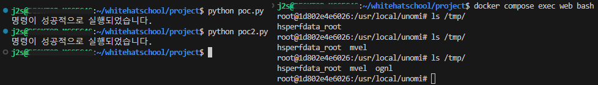

# Apache Unomi 원격 표현 언어 코드 실행 취약점 (CVE-2020-13942)

**Contributors**

-   [신재정(@j2s0923)](https://github.com/j2s0923)

 

### 요약

-  Apache Unomi는 고객 데이터 플랫폼을 관리하고 고객, 리드 및 방문자 데이터를 처리하며 고객 경험을 개인화하는 데 도움을 주기 위해 설계된 Java 오픈 소스 서버입니다.
-  1.5.1 버전 이전의 버전에서 Apache Unomi는 원격 공격자가 임의의 클래스를 포함할 수 있는 MVEL 및 OGNL 표현식을 사용하여 악의적인 요청을 보낼 수 있도록 허용했으며, 이로 인해 Unomi 애플리케이션의 권한으로 원격 코드 실행 (RCE)이 발생했습니다.

 

### 환경 구성 및 실행

-   `docker compose up -d` 명령어로 테스트 환경을 실행합니다.
-   환경이 시작되면 `http://your-ip:8181` 또는 `https://your-ip:9443`을 통해 Unomi의 API에 액세스할 수 있습니다.
-   취약점은 포트 8181 및 9443을 통해 트리거할 수 있습니다.
-   `python3 poc.py` 명령어로 MVEL 표현식을 통한 poc 코드를 실행합니다.
-   `python3 poc2.py` 명령어로 OGNL 표현식을 통한 poc 코드를 실행합니다.
-   `docker compose exec web bash` 명령어로 Docker 컨테이너에 들어가보면 명령이 성공적으로 실행되었음을 확인할 수 있습니다.

 

### 결과

 

### 정리

-   이 취약점은 공격자에게 서버에 액세스하고 관리자 권한으로 원격 코드 실행을 허용하므로 매우 심각한 취약점입니다. 따라서 시스템 관리자와 개발자들은 이 취약점에 대한 대응을 우선적으로 진행해야 합니다.