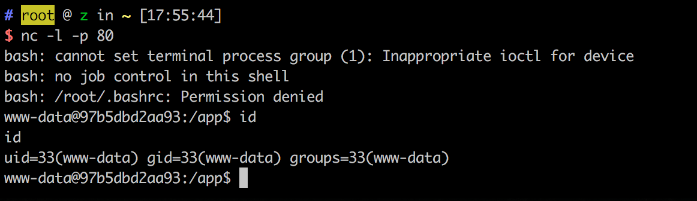

# Python unpickle 명령 실행 취약성

## 원리

참고문장:

- - http://rickgray.me/2015/09/12/django-command-execution-analysis.html
- - https://www.leavesongs.com/PENETRATION/zhangyue-python-web-code-execute.html

## 테스트

컴파일 및 실행 테스트 환경:

```
docker compose build
docker compose up -d
```

`http://your-ip:8000` 에 접속하면, `Hello {username}!`.username은 쿠키 변수 user를 취하여 base64 복호화+반시퀀스화 후 복원하는 객체의 "username" 변수입니다. 기본값은 "Guest"이고, 의사 코드: `pickle_decode(base64_decode(cookie['user')))['username'] or `Guest`입니다.

 exp.py를 호출하고, 쉘이 올라옵니다.:


