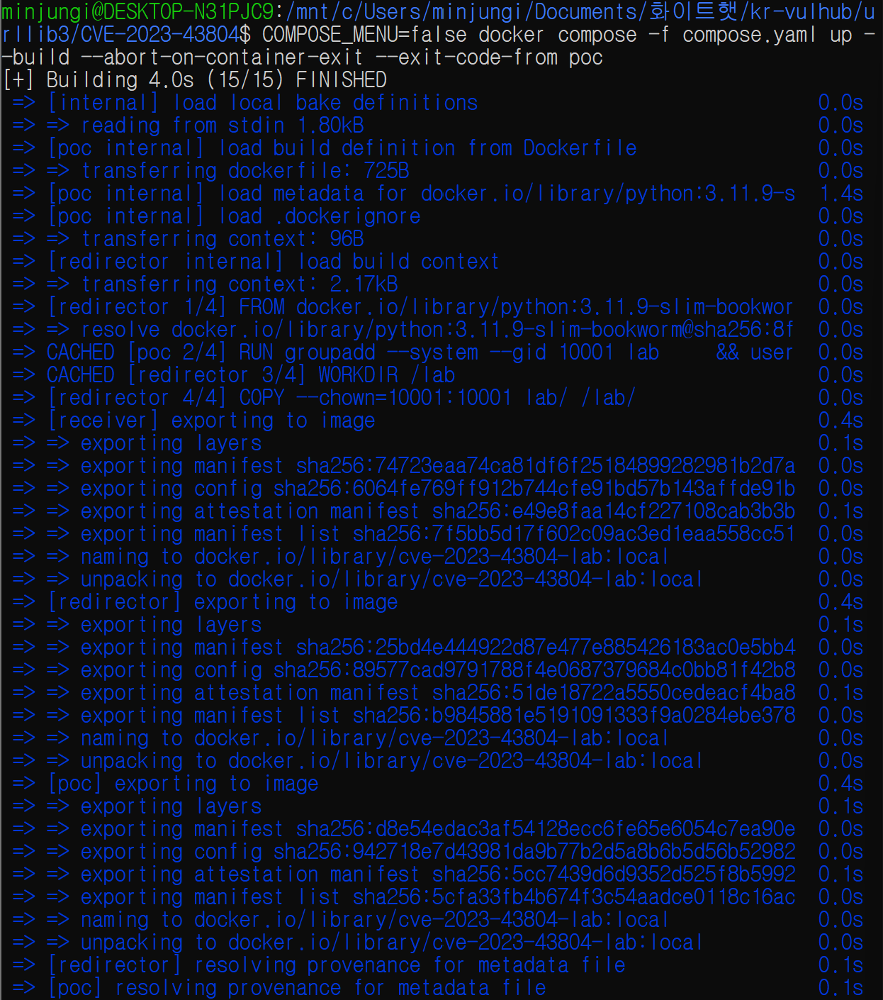
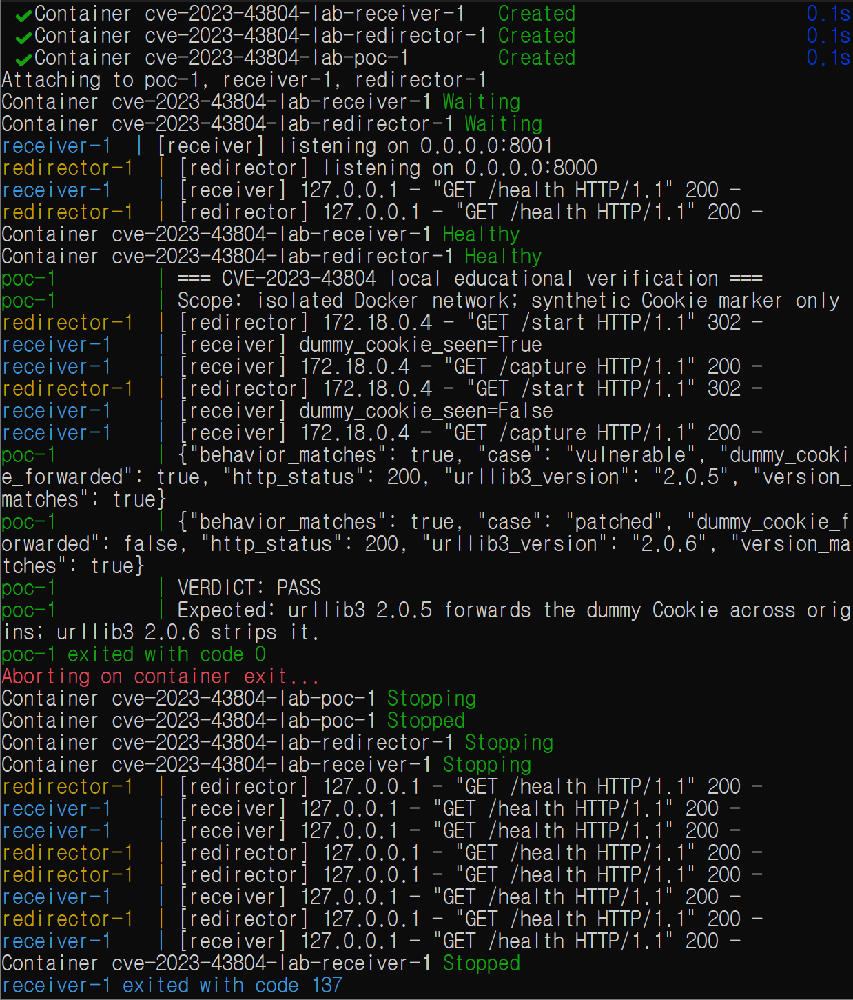

# urllib3 교차 출처 리다이렉트 Cookie 헤더 유출 (CVE-2023-43804)

> Contributor: [@minjungi11](https://github.com/minjungi11)  
> Risk Score: **5.9 / 10.0** (GitHub CNA CVSS v3.1)  
> Reproducibility: **95%**

## 1. 취약점 요약

urllib3는 Python에서 사용하는 HTTP 클라이언트 라이브러리다. CVE-2023-43804는
영향받는 urllib3 버전에서 사용자가 직접 지정한 `Cookie` 요청 헤더가 자동
리다이렉트 과정에서 다른 출처(origin)로 전달될 수 있는 정보 노출 취약점이다.

| 항목 | 내용 |
| --- | --- |
| CVE | CVE-2023-43804 |
| 취약점 유형 | 교차 출처 리다이렉트 과정의 Cookie 헤더 노출 |
| CWE | CWE-200: Exposure of Sensitive Information to an Unauthorized Actor |
| 영향받는 버전 | urllib3 1.26.16 이하, 2.0.0 이상 2.0.5 이하 |
| 실습 취약 버전 | urllib3 2.0.5 |
| 패치 버전 | urllib3 1.26.17, 2.0.6 |
| 인증 필요 여부 | 특정 사용 조건 필요 |
| 주요 영향 | 기밀성 및 무결성 영향 가능 |

GitHub의 urllib3 보안 권고는 다음 조건이 모두 충족될 때 영향을 받을 수 있다고
설명한다.

1. 영향받는 urllib3 버전을 사용한다.
2. 애플리케이션이 요청에 `Cookie` 헤더를 직접 지정한다.
3. 자동 리다이렉트를 비활성화하지 않았다.
4. HTTP를 사용하거나, 신뢰한 원본 서버가 다른 출처로 리다이렉트하도록 변경된다.

## 2. 교육 목적 및 안전 범위

이 저장소는 소유자가 통제하는 로컬 Docker 환경에서 CVE 동작을 학습하기 위한
교육용 실습이다. 실제 쿠키, 계정정보, 토큰 및 외부 시스템은 사용하지 않는다.

- `WHITEHAT_LAB_COOKIE`라는 합성 문자열만 사용한다.
- 모든 서비스는 외부 통신이 차단된 Docker `internal` 네트워크에서 동작한다.
- 호스트 포트를 게시하지 않는다.
- 컨테이너는 UID/GID `10001`의 non-root 사용자로 실행한다.
- 모든 Linux capability를 제거한다.
- `no-new-privileges`와 읽기 전용 루트 파일시스템을 적용한다.
- `--privileged` 및 Docker 소켓 마운트를 사용하지 않는다.

## 3. 취약점 원리

HTTP 클라이언트가 리다이렉트를 자동으로 따라갈 때 요청 대상의 출처가 변경될 수
있다. 인증과 관련된 요청 헤더가 새 출처로 그대로 전달되면 해당 출처가 원래
수신해서는 안 되는 정보를 볼 수 있다.

urllib3 2.0.5에서는 사용자가 직접 설정한 `Cookie` 헤더가 교차 출처 리다이렉트
뒤에도 남을 수 있다. urllib3 2.0.6은 리다이렉트 시 해당 헤더를 기본적으로
제거하도록 수정됐다.

```text
PoC 컨테이너
  |
  | GET /start + Cookie: WHITEHAT_LAB_COOKIE=...
  v
redirector:8000
  |
  | HTTP 302 Location: http://receiver:8001/capture
  v
receiver:8001
  |
  +-- urllib3 2.0.5: 합성 Cookie 수신
  +-- urllib3 2.0.6: 합성 Cookie 미수신
```

## 4. 환경 구성

### 4.1 구성 요소

| 서비스 | 역할 |
| --- | --- |
| `redirector` | `/start` 요청에 내부 `receiver` 주소로 HTTP 302 응답 반환 |
| `receiver` | 리다이렉트된 요청에 합성 Cookie가 포함됐는지만 JSON으로 반환 |
| `poc` | urllib3 2.0.5와 2.0.6을 순서대로 실행하고 결과 자동 판정 |

### 4.2 파일 구조

```text
CVE-2023-43804/
├── Dockerfile
├── compose.yaml
├── README.md
├── images/
│   ├── 01-environment-start.png
│   └── 02-reproduction-pass.png
└── lab/
    ├── client_case.py
    ├── poc.py
    ├── receiver_server.py
    └── redirect_server.py
```

### 4.3 버전 고정 및 자체 빌드

제3자가 미리 제작한 취약 이미지를 사용하지 않는다. 공식 Python 베이스 이미지
`python:3.11.9-slim-bookworm` 위에 Dockerfile로 다음 버전을 직접 설치한다.

- 취약 대조군: `urllib3==2.0.5`
- 패치 대조군: `urllib3==2.0.6`

urllib3는 `--no-deps`로 각각 별도 경로에 설치해 실행 시 다른 버전이 섞이지 않게
한다.

### 4.4 검증 환경

| 항목 | 검증 값 |
| --- | --- |
| Host | Windows + WSL2 |
| WSL | Ubuntu 22.04.5 LTS |
| Architecture | x86_64 |
| Docker Engine | 29.6.1 |
| Docker Compose | v5.2.0 |

## 5. 취약 조건

본 실습에서 취약 동작이 발생하려면 다음 조건이 필요하다.

1. 클라이언트가 urllib3 2.0.5를 사용한다.
2. 요청에 합성 `Cookie` 헤더를 직접 설정한다.
3. urllib3의 자동 리다이렉트가 활성화돼 있다.
4. `redirector`와 `receiver`가 서로 다른 호스트 이름으로 구성돼 출처가 변경된다.
5. 리다이렉트 목적지가 합성 Cookie 수신 여부를 기록한다.

패치 대조군은 애플리케이션 코드와 네트워크 조건을 동일하게 유지하고 urllib3만
2.0.6으로 변경한다.

## 6. 재현 절차

### 6.1 저장소 이동

```bash
cd urllib3/CVE-2023-43804
```

### 6.2 환경 구성 및 PoC 실행

다음 명령 하나로 이미지 빌드, 서비스 기동, healthcheck, PoC 실행 및 결과 판정이
이뤄진다.

```bash
docker compose -f compose.yaml up --build \
  --abort-on-container-exit \
  --exit-code-from poc
```

성공 시 `poc` 서비스가 종료 코드 0을 반환한다. `--abort-on-container-exit` 옵션은
PoC 종료 후 대기 중인 두 HTTP 서버를 중지한다. 이 과정에서 서버가 종료 코드
137을 표시할 수 있으나 PoC 종료 코드가 0이고 `VERDICT: PASS`라면 정상이다.

### 6.3 환경 정리

```bash
docker compose -f compose.yaml down --volumes --remove-orphans
```

## 7. PoC 코드

`lab/client_case.py`는 외부 시스템이나 실제 인증정보를 사용하지 않고, 합성 Cookie를
내부 `redirector`에 전송한 뒤 내부 `receiver`가 이를 받았는지 비교한다.

```python
import json
import os
import sys

import urllib3


REDIRECT_URL = "http://redirector:8000/start"


def main() -> int:
    case = os.environ.get("LAB_CASE", "unknown")
    marker = f"WHITEHAT_LAB_COOKIE={case}-demo-only"

    client = urllib3.PoolManager()
    response = client.request(
        "GET",
        REDIRECT_URL,
        headers={"Cookie": marker},
        redirect=True,
        timeout=urllib3.Timeout(connect=2.0, read=2.0),
    )
    payload = json.loads(response.data.decode("utf-8"))
    leaked = payload.get("cookie") == marker

    print(
        json.dumps(
            {
                "case": case,
                "urllib3_version": urllib3.__version__,
                "http_status": response.status,
                "dummy_cookie_forwarded": leaked,
            },
            sort_keys=True,
        )
    )
    return 0


if __name__ == "__main__":
    sys.exit(main())
```

`lab/poc.py`는 취약 버전과 패치 버전을 각각 분리된 `PYTHONPATH`에서 실행한다.
다음 조건을 모두 만족해야 종료 코드 0과 `VERDICT: PASS`를 출력한다.

1. 실제 로드된 urllib3 버전이 각각 2.0.5와 2.0.6이다.
2. 취약 버전에서는 합성 Cookie 전달이 확인된다.
3. 패치 버전에서는 동일한 합성 Cookie가 제거된다.
4. 두 요청 모두 내부 수신 서비스에서 HTTP 200 응답을 받는다.

전체 PoC 소스는 [`lab/poc.py`](lab/poc.py)에서 확인할 수 있다.

## 8. 실행 결과

### 8.1 환경 직접 빌드

공식 Python 베이스 이미지를 내려받아 Dockerfile의 모든 단계를 완료했다.



### 8.2 취약 버전과 패치 버전 비교

실제 실행 결과는 다음과 같다.

```text
{"behavior_matches": true, "case": "vulnerable", "dummy_cookie_forwarded": true,
 "http_status": 200, "urllib3_version": "2.0.5", "version_matches": true}
{"behavior_matches": true, "case": "patched", "dummy_cookie_forwarded": false,
 "http_status": 200, "urllib3_version": "2.0.6", "version_matches": true}
VERDICT: PASS
```



취약 버전에서는 합성 Cookie가 교차 출처 리다이렉트 뒤에도 전달됐다. 동일한 코드와
환경에서 패치 버전은 Cookie를 제거했다. 이 차이로 CVE-2023-43804의 취약 동작과
패치 효과를 함께 확인했다.

## 9. 대응 방안

1. urllib3 1.x 사용자는 1.26.17 이상으로 업데이트한다.
2. urllib3 2.x 사용자는 2.0.6 이상으로 업데이트한다.
3. 리다이렉트가 필요하지 않은 요청은 `redirect=False`로 자동 리다이렉트를 끈다.
4. 리다이렉트 목적지의 scheme, host, port를 허용 목록으로 검증한다.
5. 사용자 세션 Cookie를 임의의 HTTP 요청 헤더로 직접 복사하지 않는다.
6. HTTPS를 사용하고 신뢰할 수 없는 HTTP 리다이렉트를 허용하지 않는다.
7. 업데이트 후 취약 버전과 동일한 회귀 테스트를 실행해 Cookie 제거를 확인한다.

## 10. 평가

### 10.1 Reproducibility: 95%

재현성을 높이는 요소는 다음과 같다.

- 단일 `docker compose up --build` 명령으로 환경이 완성된다.
- 취약 버전과 패치 버전을 Dockerfile에서 고정한다.
- 외부 서버나 실시간 외부 API에 의존하지 않는다.
- 모든 런타임 통신이 Docker 내부 네트워크에서 끝난다.
- healthcheck 이후 PoC를 실행한다.
- 버전과 취약 동작을 코드로 자동 판정하고 실패 시 비정상 종료한다.
- 실제 Cookie 대신 저장소에 포함된 합성 마커만 사용한다.

최초 빌드 시 공식 Python 이미지와 PyPI 패키지를 내려받기 위한 레지스트리 접근이
필요하므로 외부 레지스트리 장애 가능성을 고려해 5%를 제외했다.

### 10.2 Risk Score: 5.9 / 10.0

본 보고서는 urllib3 프로젝트의 GitHub 보안 권고에 표시된 GitHub CNA CVSS v3.1
점수를 채택한다.

```text
CVSS:3.1/AV:N/AC:H/PR:H/UI:N/S:U/C:H/I:H/A:N = 5.9 Medium
```

취약점은 네트워크를 통해 영향을 줄 수 있고 유출된 Cookie의 권한에 따라 기밀성과
무결성 영향이 클 수 있다. 다만 영향받는 버전, 직접 지정한 Cookie 헤더, 자동
리다이렉트, 신뢰한 서비스의 교차 출처 리다이렉트라는 여러 조건이 필요해 공격
복잡도와 사전 조건이 높다.

NVD는 별도 분석으로 8.1 High
(`CVSS:3.1/AV:N/AC:L/PR:L/UI:N/S:U/C:H/I:H/A:N`)을 제공한다. 두 기관의 차이는
필요 권한과 공격 복잡도 평가 차이에서 발생하며, 본 보고서는 실제 urllib3 사용
조건을 상세히 반영한 CNA 점수를 사용했다.

## 11. 참고 자료

- [GitHub Security Advisory GHSA-v845-jxx5-vc9f](https://github.com/urllib3/urllib3/security/advisories/GHSA-v845-jxx5-vc9f)
- [NVD CVE-2023-43804](https://nvd.nist.gov/vuln/detail/CVE-2023-43804)
- [urllib3 2.0.6 release](https://github.com/urllib3/urllib3/releases/tag/2.0.6)
- [urllib3 patch commit](https://github.com/urllib3/urllib3/commit/01220354d389cd05474713f8c982d05c9b17aafb)
